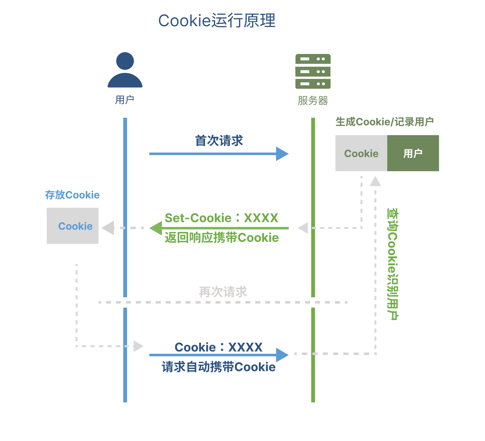

# Cookie

**Cookie是服务器发送到用户浏览器并保存在本地的一小块文本数据，浏览器会存储 Cookie 并在下次向同一服务器再发起请求时携带并发送到服务器上，用于跟踪用户与网站的互动、存储用户相关信息以及保持用户状态等**，Cookie 使基于无状态的 HTTP 协议记录稳定的状态信息成为了可能。


## Cookie的运行方式

Cookie的运行主要依赖于HTTP的`Set-Cookie`响应标头（服务器发送创建的Cookie）以及`Cookie`请求标头（客户端携带保存的Cookie），其运行步骤如下：



- **服务器创建Cookie：** 服务器在收到 HTTP 请求后将创建Cookie并记录用户相关信息，最后通过在响应中添加一个或多个 `Set-Cookie`响应头，将Cookie发送给客户端
- **客户端保存Cookie：** 客户端收到响应后，浏览器会自动将`Set-Cookie`中的内容保存起来
- **客户端再次发起请求，浏览器自动携带Cookie：** 等到客户端再次向同一服务器发出请求时，浏览器会**自动**将保存的Cookie内容放在`Cookie`请求头内，发送给服务器
- **服务器根据Cookie识别身份：** 服务器在收到请求后，可以根据请求中的 Cookie 数据来识别用户，继续用户的会话，或根据需要执行其他操作，以保持状态

从上述描述中我们都应该清楚了Cookie的运行主要依赖于HTTP的`Set-Cookie`响应标头以及`Cookie`请求标头，那么下面我们详细学习下这两个标头的具体内容。


### Set-cookie`响应标头`

响应标头 **`Set-Cookie`** 被用来由服务器端向客户端发送 Cookie，以便于客户端在后续的请求中将其发送回服务器识别身份使用。服务器如果要发送多个 cookie，则应该在同一响应中设置多个 **`Set-Cookie`** 标头。


**参数**

- **\<cookie-name>=\<cookie-value>**

  一个有名称与值组成的键值对，用于表示需要传输的Cookie的名称以及值

  ::: danger 注意

  - `<cookie-name>` 不能包含控制字符、空格、制表符以及以下分隔字符：`( ) < > @ , ; : \ " / [ ] ? = { }`，除此之外的任何 US-ASCII 字符都是被允许的。 
  - 一些 `<cookie-name>` 具有特殊的语义，例如：`__Secure-` 前缀以及`__Host-` 前缀，名称中包含 `__Secure-` 或 `__Host-` 前缀的 cookie，只可以应用在使用了安全连接（HTTPS）的域中，需要同时设置 `secure` 属性，另外名称中包含了 `__Host-` 前缀，那么 path 属性的值必须为 `/`（表示整个站点），且不能含有 `Domain` 属性。
  - `<cookie-value>` 不能包含控制字符、空格、双引号、逗号、分号以及反斜线，除此之外的任何 US-ASCII 字符都是被允许的，并且它可以包裹在双引号中。

  :::

- **Expires=\<date>** `可选`

  用于指定cookie 的有效时间（取值格式例如：Wed, 21 Oct 2015 07:28:00 GMT），如果没有设置这个属性，那么表示这是一个**会话期 cookie**。一个会话结束于客户端被关闭时，这意味着会话期 cookie 会在客户端被关闭时移除。

  ::: danger 注意

  - 如果设置了 `Expires` 属性，其截止时间仅与客户端时间相关，而非服务器的时间。也就是说如果客户端修改了时间，浏览器则会认为此Cookie未过期并发送到服务器，而除了业务代码自行处理外，服务器并不会自动记录并判断Cookie是否过期。

  - 目前有很多现代Web 浏览器支持会话恢复功能，这个功能可以使浏览器保留所有的 tab 标签，然后在重新打开浏览器的时候将其还原，与此同时，cookie 也会恢复，就跟从来没有关闭浏览器一样，这会导致**会话期Cookie**一直有效，造成不必要的安全风险。

  :::

- **Max-Age=\<number>**  `可选`

  用于指定Cookie经过多少秒后失效，秒数为 0 或 -1 将会使 cookie 直接过期。假如 `Expires` 和 `Max-Age` 属性均存在，那么 `Max-Age` 的优先级更高，`Max-Age`属性的出现就是为了解决`Expires`属性设置的时间仅与客户端时间相关的问题。

- **Domain=\<domain-value>**  `可选`

  用于指定Cookie存放的域名，以及哪些主机可以发送 Cookie。如果不指定，该属性默认为当前文档访问地址中的主机部分（也就是请求中的Host标头），不包含子域名。如果指定了 `Domain`，则一般包含子域名。因此，指定 `Domain` 比省略它的限制要少。但是，当子域需要共享有关用户的信息时，这可能会有所帮助。

- **Path=\<path-value>**   `可选`

  该属性指定了一个 URL 路径，用于指定Cookie存放的域的路径，以及哪些URL路径可以发送 Cookie。表示这个URL路径必须出现在请求的资源的路径中浏览器才会发送 `Cookie` 标头，URL路径以字符`/` 作为路径分隔符，并且子路径也会被匹配，例如，设置 `Path=/docs`，则以下地址都会匹配：`/docs`、`/docs/`、`/docs/Web/`、`/docs/Web/HTTP`

- **Secure**  `可选`

  指定只有在请求使用 `https:` 协议（localhost 不受此限制）的时候才会被发送到服务器，以此阻止中间人攻击获取Cookie。

- **HttpOnly**  `可选`

  用于阻止 JavaScript 通过 `Document.cookie`属性访问 cookie。注意，设置了 `HttpOnly` 的 cookie 在 js的请求中仍然会被发送，例如，调用 `XMLHttpRequest.send()` 或 `fetch()`。该属性主要其用于防范跨站脚本攻击（XSS）窃取Cookie。

- **SameSite=\<samesite-value>** `可选`

  指定 cookie 是否能够随着跨站请求一起发送，这样可以在一定程度上防范跨站请求伪造攻击。

  可选的属性值有：

  - `Strict`：浏览器在同源的请求才会携带Cookie，浏览器仅对同一站点的请求发送 `cookie`，即请求来自设置 cookie 的站点。如果请求不同源，即来自不同的域或协议（即使是相同域），则携带有 `SameSite=Strict` 属性的 cookie 将不会被发送。
  - `Lax`：浏览器在某些情况下会发送 Cookie，在用户从外部站点导航到源站时cookie将被发送（例如，用户点击链接或输入 URL），在 POST 请求以及嵌套的跨站点请求中（如通过 `` 或 `<iframe>`）不会被发送。这是 `SameSite` 属性未被设置时的默认行为。
  - `None`：浏览器会在跨站和同站请求中均发送 cookie。在设置这一属性值时，必须同时设置 `Secure` 属性，就像这样：`SameSite=None; Secure`。


**示例**

```http
// 会话期Cookie，将会在客户端关闭时被移除。会话期 cookie 不设置 Expires 或 Max-Age 属性。
Set-Cookie: sessionId=38afes7a8
// 持久化 cookie，不会在客户端关闭时失效，而是在特定的日期（Expires）或者经过一段特定的时间之后（Max-Age）才会失效。
Set-Cookie: id=a3fWa; Expires=Wed, 21 Oct 2015 07:28:00 GMT
Set-Cookie: id=a3fWa; Max-Age=2592000
// 限制域的Cookie
Set-Cookie:test=123;Domain=wangjunliang.com
// 一些名称包含了__Secure-、__Host-前缀的Cookie，当响应来自于一个安全域（HTTPS）的时候且设置了Secure属性，二者都可以被客户端接受
Set-Cookie: __Secure-ID=123; Secure; Domain=example.com
Set-Cookie: __Host-ID=123; Secure; Path=/
// 缺少 Secure 指令，会被拒绝
Set-Cookie: __Secure-id=1
// 名称包含了 __Host-前缀的cookie缺少 Path=/ 指令，会被拒绝
Set-Cookie: __Host-id=1; Secure
// 名称包含了 __Host-前缀的cookie由于设置了 domain 属性，会被拒绝
Set-Cookie: __Host-id=1; Secure; Path=/; domain=example.com
```


### Cookie`请求标头`

在发起请求时，请求标头 `Cookie` 将会被浏览器自动携带，其中包含了存储在客户端的与该请求源相关的 Cookie。这些 Cookie 可以是先前由服务器通过 `Set-Cookie` 标头设置的，也可以是通过 JavaScript 的 `document.cookie` 方法设置的。为保护隐私，用户可在浏览器的隐私设置里面设置禁用 cookie，此时浏览器发起的所有请求将不会携带`Cookie`请求头。


**参数**

该请求标头并无其他参数


**取值**

- **<name=value; name2=value2; name3=value3；.......>**

  携带的Cookie列表，由一系列的Cookie键值对组成，形式为 `name=value`，键值对之间用分号和空格（`'; '`）隔开。

  

**示例**

```http
Cookie: PHPSESSID=298zf09hf012fh2;
Cookie: PHPSESSID=298zf09hf012fh2; csrftoken=u32t4o3tb3gg43;
Cookie: PHPSESSID=298zf09hf012fh2; csrftoken=u32t4o3tb3gg43; _gat=1
```


## Cookie的安全风险

当你存储信息到 Cookie 中时，需要明白 Cookie的值是存储在用户终端的本地文件中的，而且用户通常可以访问和修改这些值。此外，浏览器会自动将Cookie值包含在每个相关请求中，这意味着如果Cookie不合理配置，可能会导致许多安全风险。

- **携带secure属性，以防止MitM攻击窃取Cookie：** 设置Cookie的secure属性会将其限制为仅在加密的HTTPS连接中传输，从而减少中间人攻击的风险。
- **携带HttpOnly属性，以防止XSS攻击窃取Cookie：** 通过将Cookie标记为HttpOnly，您可以防止通过JavaScript脚本访问Cookie，减少了XSS攻击的成功机会，如果需要JS访问Cookie，则需要做好[XSS攻击的防护手段](https://wangjunliang.com/HTTP-Explanation/docs/security-strategy/common-attack-and-protection-methods.html#xss)。
- **设置SameSite属性，以防止CSRF攻击：** 通过设置SameSite属性，您可以限制浏览器仅在同源请求中发送Cookie，从而降低CSRF攻击的可能性。但如果需要跨源访问时携带Cookie则SameSite属性必须设置None，此时则会有被点击劫持/CSRF攻击的风险，因此需要设置[CSP策略防止点击劫持攻击](https://wangjunliang.com/HTTP-Explanation/docs/security-strategy/common-attack-and-protection-methods.html#%E7%82%B9%E5%87%BB%E5%8A%AB%E6%8C%81)，并做好[CSRF攻击防护手段](https://wangjunliang.com/HTTP-Explanation/docs/security-strategy/common-attack-and-protection-methods.html#csrf)
- **经常更新Cookie以防止会话固定攻击：** 会话固定攻击是攻击者尝试绑定用户会话到特定的会话标识符上。通过定期更改会话标识符，您可以降低这种攻击的成功几率。


## 第三方Cookie

Cookie 与特定域、协议（例如，`http` 或 `https`）以及端口号相关联，如果设置了 `Set-Cookie`的`Domain` 属性，也可能与子域相关联。如果该 cookie 域、协议（例如，`http` 或 `https`）以及端口号匹配当前的页面，则认为该 cookie 和该页面来自同一站点，则称为*第一方 cookie（first-party cookie）*。

如果任一不同，则它不认为来自同一个站点，被称为*第三方 cookie（third-party cookie）*。第三方Cookie主要用于追踪用户行为、广告投放、分析和其他跨站点用途。例如，Google分析，你肯定很好奇为什么我没登陆，Google分析是如何判断用户是谁的？IP？但不准确呀，其实它使用的就是第三方Cookie。

::: danger 注意

Firefox 默认情况下会阻止已知包含跟踪器的第三方 cookie。第三方 cookie（或仅跟踪 cookie）也可能被其他浏览器设置或扩展程序阻止。阻止 Cookie 会导致某些第三方组件（例如社交媒体窗口小部件）无法正常运行。

:::


## 本节参考


- https://developer.mozilla.org/zh-CN/docs/Web/HTTP/Cookies
- https://developer.mozilla.org/zh-CN/docs/Web/HTTP/Headers/Set-Cookie
- https://developer.mozilla.org/zh-CN/docs/Web/HTTP/Headers/Cookie


转载需要经过本人同意，并标明出处！