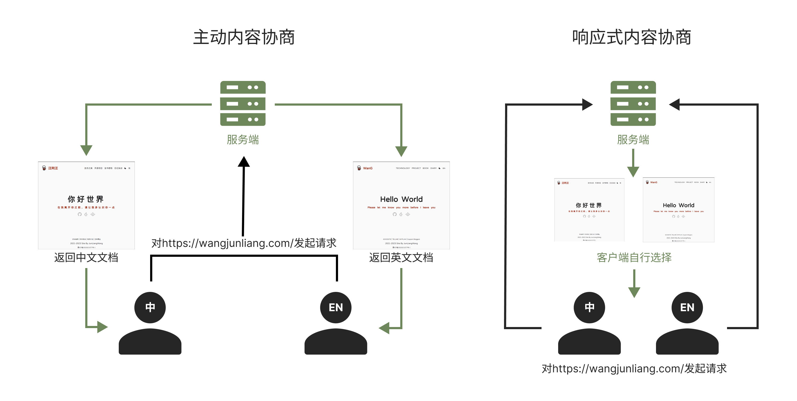

# 内容协商

**在HTTP协议中，内容协商是一种用于为同一URI 提供资源不同的表示形式（如语言、字符集、媒体类型等）的机制，该机制能够让用户获得最合适的资源表现内容**。例如对于中文用户请求某一URI内容，服务器将返回该资源的中文形式；而英语用户请求同一资源时，则会返回该资源的英文形式。

# 内容协商的分类

**HTTP内容协商分为了主动内容协商与响应式协商**，主动协商由客户端发起，通过在请求中设置特定的请求标头来进行；响应式协商则有服务端发起，通过返回特定的响应状态码来进行。

## 主动内容协商

客户端在发送请求时会携带一系列内容协商的请求标头，这些标头描述了用户倾向的选择。服务器收到请求后会根据这些标头来选择最佳的资源表现形式返回给客户端，如果它不能提供一个合适的资源，它可能使用 [`406`](https://developer.mozilla.org/zh-CN/docs/Web/HTTP/Status/406)（Not Acceptable）、[`415`](https://developer.mozilla.org/zh-CN/docs/Web/HTTP/Status/415)（Unsupported Media Type）进行响应并为其支持的媒体类型设置标头。

目前HTTP内容协商机制有对内容类型的协商（使用标头`Accept`）、对内容字符编码的协商 （使用标头`Accept-Charset`）、对内容语言的协商（使用标头`Accept-Language`）以及对内容压缩格式的协商（使用标头`Accept-Encoding`）这四种协商方式。

### 内容类型协商

**内容类型协商使用`Accept`请求头来告知（服务器）客户端可以处理的内容类型，这种内容类型用[MIME 类型](https://developer.mozilla.org/zh-CN/docs/Web/HTTP/Basics_of_HTTP/MIME_types)来表示。服务器收到请求后会根据`Accept`提供的内容类型来匹配该资源合适的类型进行响应，并使用 `Content-Type`响应头通知客户端它的选择。如果该资源没有匹配的类型，将会返回一个[`415`](https://developer.mozilla.org/zh-CN/docs/Web/HTTP/Status/415)（Unsupported Media Type，不支持的媒体类型）的错误码。**

浏览器会为这个请求头**自动设置**合适的值，比如在获取一个 CSS 层叠样式表、图片、视频或脚本文件时会自动设置相应的MIME类型。

### 字符编码协商

### 语言协商

### 压缩格式协商

## 响应式内容协商

# 相关标头

# 本节参考