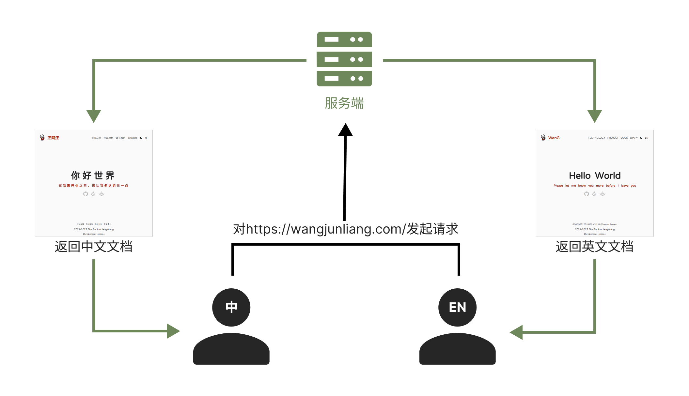
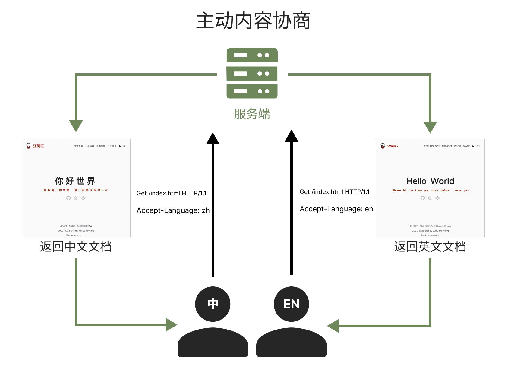
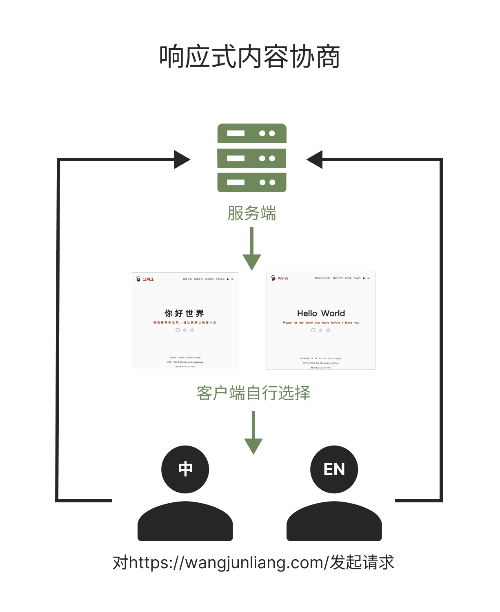

# 内容协商

**在HTTP协议中，内容协商是一种用于为同一URI 提供资源不同的表示形式（如语言、字符集、媒体类型等）的机制，该机制能够让用户获得最合适的资源表现内容**。例如对于中文用户请求某一URI内容，服务器将返回该资源的中文形式；而英语用户请求同一资源时，则会返回该资源的英文形式。




## 内容协商的分类

**HTTP内容协商分为了主动内容协商与响应式协商**，主动协商由客户端发起，通过在请求中设置特定的请求标头来进行；响应式协商则有服务端发起，通过返回特定的响应状态码来进行。


### 主动内容协商

客户端在发送请求时会**携带一系列内容协商的请求标头**，这些标头描述了用户倾向的选择。服务器收到请求后会**根据这些标头来选择最佳的资源表现形式返回给客户端**，如果它不能提供一个合适的资源，它可能使用 `406`（Not Acceptable）、`415`（Unsupported Media Type）进行响应并为其支持的媒体类型设置标头。



目前HTTP内容协商机制有对内容类型的协商（使用标头`Accept`）、对内容字符编码的协商 （使用标头`Accept-Charset`）、对内容语言的协商（使用标头`Accept-Language`）以及对压缩算法的协商（使用标头`Accept-Encoding`）这四种协商方式。


#### 内容类型协商（Accept/Content-Type）

**内容类型协商使用`Accept`请求头来告知（服务器）客户端期待的内容类型，这种内容类型用[MIME 类型](https://developer.mozilla.org/zh-CN/docs/Web/HTTP/Basics_of_HTTP/MIME_types)来表示。服务器收到请求后会根据`Accept`提供的内容类型来匹配该资源合适的类型进行响应，并使用 `Content-Type`实体头通知客户端它的选择。如果该资源没有匹配的类型，将会返回一个`415`（Unsupported Media Type，不支持的媒体类型）的错误码。**

浏览器会为这个请求头**自动设置**合适的值，比如在获取一个 CSS 层叠样式表、图片、视频或脚本文件时会自动设置相应的MIME类型。

```http
//请求使用Accpet告知（服务器）客户端期待的内容类型为HTML文档
Accept: text/html
//响应使用Content-Type告知客户端它的选择
Content-Type: text/html
```


#### 字符编码协商（Accept-Charset/Content-Type）

**字符编码协商使用`Accept-Charset` 请求头来告知（服务器）客户端可以处理的字符集类型。服务器收到请求后会根据`Accept-Charset`提供的字符编码来匹配该资源合适的编码版本进行响应，并使用 `Content-Type`实体头通知客户端它的选择。如果服务器不能提供任何可以匹配的字符集的版本，那么理论上来说应该返回一个`406`（Not Acceptable，不被接受）的错误码。但是为了更好的用户体验，这种方法很少采用，取而代之的是将其忽略。**

```http
//请求使用Accept-Charset告知（服务器）客户端可以处理的字符集类型为utf-8
Accept-Charset:utf-8
//响应使用Content-Type告知客户端它的选择
Content-Type: text/html; charset=utf-8
```

::: danger `Accept-Charset`请求标头已被大部分浏览器移除

大多数浏览器已经不再广泛使用`Accept-Charset`头字段进行字符编码协商，因为现代网页通常使用 Unicode 字符集（如UTF-8）来处理多语言支持，它能够涵盖世界上大多数的字符。因此，浏览器通常会默认使用 UTF-8，而不再需要协商字符编码，`Accept-Charset`头也因此被认为是不必要的了。

:::


#### 语言协商（Accept-Language/ Content-Language）

**语言协商使用` Accept-Language`  请求头来告知（服务器）客户端能够理解的自然语言，以及优先选择的区域方言。服务器收到请求后会根据客户端的提议匹配该资源合适的语言版本进行响应，并使用 `Content-Language`实体头通知客户端它的选择。如果服务器不能提供任何可以匹配的语言的版本，那么理论上来说应该返回一个`406`（Not Acceptable，不被接受）的错误码。但是为了更好的用户体验，这种方法很少被采用，取而代之的是将其忽略。**

浏览器会基于其用户界面语言为这个请求头**自动设置**合适的值。

```http
//请求使用Accept-Language告知（服务器）客户端能够理解的自然语言为中文简体
Accept-Language:zh-CN
//响应使用Content-Language告知客户端它的选择
Content-Language:zh-CN
```


#### 压缩算法协商（Accept-Encoding/Content-Encoding）

**压缩算法协商使用` Accept-Encoding`  请求头来告知（服务器）客户端能够理解的内容编码方式——通常是某种压缩算法。服务器收到请求后会选择一个客户端提议的压缩算法应用，使用并在实体头`Content-Encoding`中通知客户端该选择。只要没有被明确禁止使用压缩算法，则服务器不会返回`406`（Not Acceptable，不被接受）的错误码；否则，无法匹配则会返回该错误码。**

浏览器会为这个请求头**自动设置**合适的值。

```http
//请求使用Accept-Encoding告知（服务器）客户端能够理解的内容编码方式gzip
Accept-Encoding:gzip
//响应使用Content-Encoding告知客户端它的选择
Content-Encoding:gzip
```


虽然主动内容协商机制是最常用的协商方式，但它也存在如下几个缺点：

- 服务器对客户端并非全知全能。即便是有了客户端提示扩展，也依然无法获取关于客户端的全部信息。与客户端进行选择的响应式内容协商机制不同，服务器端的选择总是显得有点武断。
- 客户端提供的信息相当冗长（HTTP/2 协议的标头压缩机制缓解了这个问题），并且存在隐私风险。
- 给定的资源需要返回不同的表示形式，共享缓存的效率会降低，并且服务器端的实现会越来越复杂。


### 响应式内容协商

从 HTTP 协议制定之初，该协议就准许另外一种协商机制——响应式协商。在这种协商机制中，当面临不明确的请求时，服务器会返回一个页面，其中包含了可供选择的资源的链接。资源呈现给用户，由用户做出选择。



不幸的是，由于 HTTP 标准没有明确指定可选资源链接的页面的格式，以及相关实现的具体细节，因此该种协商方式的实现无一例外都是通过脚本技术来完成的，尤其是 JavaScript 重定向技术。也正是如此，该种协商方式没有获得人们的认可从而被逐渐遗弃。


## 相关标头


### Accept `请求标头`

**`Accept`** 请求头用来告知（服务器）客户端可以处理的内容类型，这种内容类型用[MIME 类型](https://developer.mozilla.org/zh-CN/docs/Web/HTTP/Basics_of_HTTP/MIME_types)来表示。

**参数**

该请求标头并无其他参数。

**取值**

- **[ \<MIME-type>/\<MIME-subtype>;q=\<q>, \<MIME-type>/\*,\*/\*,.......]**

  指定一系列客户端期望的内容类型，这种内容类型用[MIME 类型](https://developer.mozilla.org/zh-CN/docs/Web/HTTP/Basics_of_HTTP/MIME_types)来表示，使用逗号（,）分割。

  - **\<MIME-type>/\<MIME-subtype>：** 指定单一精确的 [MIME 类型](https://developer.mozilla.org/zh-CN/docs/Web/HTTP/Basics_of_HTTP/MIME_types)，例如`text/html`.
  - **\<MIME-type>/\*：** 一类 MIME 类型，但是没有指明子类。`image/*` 可以用来指代 `image/png`、`image/svg`、`image/gif` 以及任何其他的图片类型。
  - **\*/\*：** 任意类型的 MIME 类型。
  - **\<q>** `可选` ：小数0到1，代表期望的内容类型的优先顺序，又称为权重。

**示例**

```http
Accept: text/html
Accept: image/*
Accept: text/html,application/xhtml+xml,application/xml;q=0.9,*/*;q=0.8
```


### Content-Type `实体标头`

实体标头`Content-Type`描述了请求或响应中消息体的内容类型（这种内容类型用[MIME 类型](https://developer.mozilla.org/zh-CN/docs/Web/HTTP/Basics_of_HTTP/MIME_types)来表示）以及字符编码方式。

**参数**

- **\<MIME-type>** 

  指定一个[MIME 类型](https://developer.mozilla.org/zh-CN/docs/Web/HTTP/Basics_of_HTTP/MIME_types)，描述了请求或响应中消息体的内容类型。

- **charset=\<charset>** `可选`

  指定一个字符编码，描述了请求或响应中消息体的字符编码方式。

- **boundary=\<boundary>** `可选`

  对于多部分实体，boundary 是必需的，它指定了多个实体间的分隔符，以便将不同的部分（body parts）分隔开。

**示例**

```http
Content-Type: text/html; charset=utf-8
Content-Type: multipart/form-data; boundary=something
```


### Accept-Charset `请求标头`

**`Accept-Charset`** 请求头用来告知（服务器）客户端可以处理的字符集类型。

**参数**

该请求标头并无其他参数。

**取值**

- **[ \<charset>;q=\<q>, \<charset>,\*,.......]**

  指定一系列客户端可以处理的字符集类型，使用逗号（,）分割。

  - **\<charset>：** 指定字符集类型，诸如 `utf-8` 或 `iso-8859-15` 等。
  - **\*：** 任意字符集内容
  - **\<q>** `可选` ：小数0到1，代表字符集类型的优先顺序，又称为权重

**示例**

```http
Accept-Charset: iso-8859-1
Accept-Charset: utf-8, iso-8859-1;q=0.5
Accept-Charset: utf-8, iso-8859-1;q=0.5, *;q=0.1
```


### Accept-Language `请求标头`

**`Accept-Language`** 请求头用来告知（服务器）客户端可以理解的自然语言类型，以及优先选择的区域方言。

**参数**

该请求标头并无其他参数。

**取值**

- **[ \<language>;q=\<q>, \<language>,\*,.......]**

  指定一系列客户端可以理解的自然语言类型，使用逗号（,）分割。

  - **\<language>：** 指定自然语言类型，诸如 `en-US` 或 `zh-CN` 等。
  - **\*：** 任意语言
  - **\<q>** `可选` ：小数0到1，代表自然语言类型的优先顺序，又称为权重

**示例**

```http
Accept-Language: zh-CN
Accept-Language: en-US,en;q=0.5
Accept-Language: zh-CN,zh;q=0.8,zh-TW;q=0.7,zh-HK;q=0.5,en-US;q=0.3,en;q=0.2
```


### Content-Language `实体标头`

实体标头`Content-Language`描述了请求或响应中消息体中的内容采用的语言或语言组合。

**参数**

该实体标头并无其他参数。

**取值**

- **[ \<language>, \<language>,.......]**

  指定一系列的自然语言类型，诸如 `en-US` 或 `zh-CN` 等，使用逗号（,）分割。

**示例**

```http
Content-Language: zh-CN
Content-Language: en-US
Content-Language: de-DE, en-CA
```


### Accept-Encoding `请求标头`

**请求头 Accept-Encoding 将客户端能够理解与支持的压缩算法告知给服务端**。通过内容协商的方式，服务端会选择一个客户端提出的压缩算法，将响应主体内容进行压缩并使用 `Content-Encoding`响应头告知客户端自己选择的压缩算法。

**参数**

该请求标头并无其他参数。

**取值**

- **[ \<compress-algorithm>;q=\<q>, \<compress-algorithm>,.......]** 

  指定一系列客户端支持的压缩算法（\<compress-algorithm>），以及优先级（q=\<q>，可选），压缩算法与优先级使用分号（;）分隔，压缩算法之间使用逗号(,)分隔。

  **\<compress-algorithm>：**

  - **gzip**：表示支持 [Lempel-Ziv coding](http://en.wikipedia.org/wiki/LZ77_and_LZ78#LZ77) (LZ77) 压缩算法，以及 32 位 CRC 校验的编码方式。
  - **compress** ：表示支持  [Lempel-Ziv-Welch](http://en.wikipedia.org/wiki/LZW) (LZW) 压缩算法。
  - **deflate** ：表示支持 [zlib](http://en.wikipedia.org/wiki/Zlib) 结构和 [*deflate*](http://en.wikipedia.org/wiki/DEFLATE) 压缩算法。
  - **br** ：表示支持 [Brotli](https://en.wikipedia.org/wiki/Brotli) 算法的编码方式。
  - **identity** ：表示支持不压缩。
  - **\***：匹配其他任意未在该请求头字段中列出的编码方式。假如该请求头字段不存在的话，这个值是默认值。它并不代表任意算法都支持，而仅仅表示算法之间无优先次序。

  **\<q>** `可选` ：小数0到1，代表算法的优先顺序，又称为权重。

**示例**

```http
Accept-Encoding: gzip
Accept-Encoding: *
Accept-Encoding: gzip, compress, br
Accept-Encoding: br;q=1.0, gzip;q=0.8, *;q=0.1
```


### Content-Encoding `实体标头`

**实体标头`Content-Encoding` 列出了对当前请求或响应的消息体内容使用的压缩算法以及其编码顺序**。

**参数**

该实体标头并无其他参数。

**取值**

- **[ \<compress-algorithm>, \<compress-algorithm>,.......]** 

  指定一系列的压缩算法（\<compress-algorithm>），其前后顺序则表明了编码顺序。

  **\<compress-algorithm>：**

  - **gzip**：表示支持 [Lempel-Ziv coding](http://en.wikipedia.org/wiki/LZ77_and_LZ78#LZ77) (LZ77) 压缩算法，以及 32 位 CRC 校验的编码方式。
  - **compress** ：表示支持  [Lempel-Ziv-Welch](http://en.wikipedia.org/wiki/LZW) (LZW) 压缩算法。
  - **deflate** ：表示支持 [zlib](http://en.wikipedia.org/wiki/Zlib) 结构和 [*deflate*](http://en.wikipedia.org/wiki/DEFLATE) 压缩算法。
  - **br** ：表示支持 [Brotli](https://en.wikipedia.org/wiki/Brotli) 算法的编码方式。
  - **identity** ：表示支持不压缩。

**示例**

```http
Content-Encoding: deflate
Content-Encoding: br
Content-Encoding: deflate, gzip
```


## 本节参考

- https://developer.mozilla.org/zh-CN/docs/Web/HTTP/Content_negotiation
- https://developer.mozilla.org/zh-CN/docs/Web/HTTP/Headers/Accept
- https://developer.mozilla.org/zh-CN/docs/Web/HTTP/Headers/Content-Type
- https://developer.mozilla.org/zh-CN/docs/Web/HTTP/Headers/Accept-Charset
- https://developer.mozilla.org/zh-CN/docs/Web/HTTP/Headers/Accept-Language

转载需要经过本人同意，并标明出处！