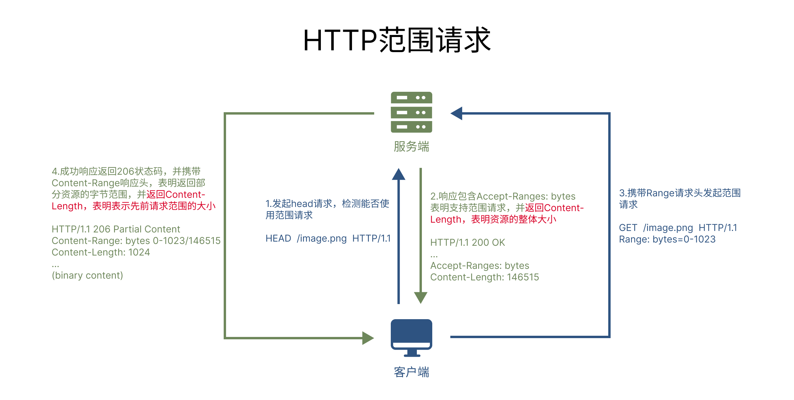
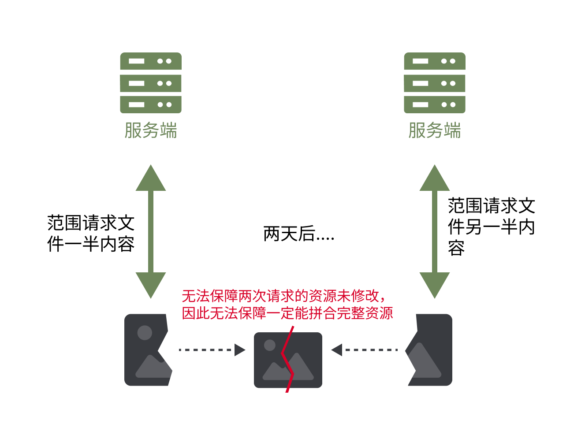
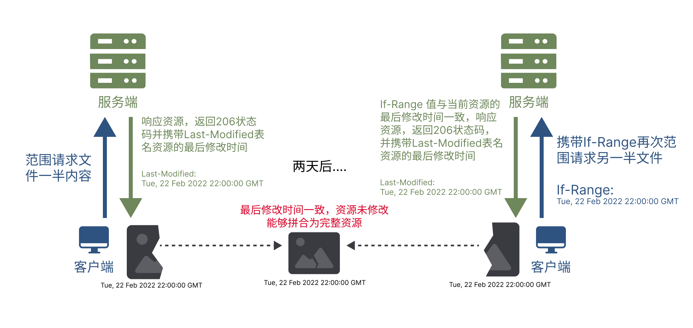
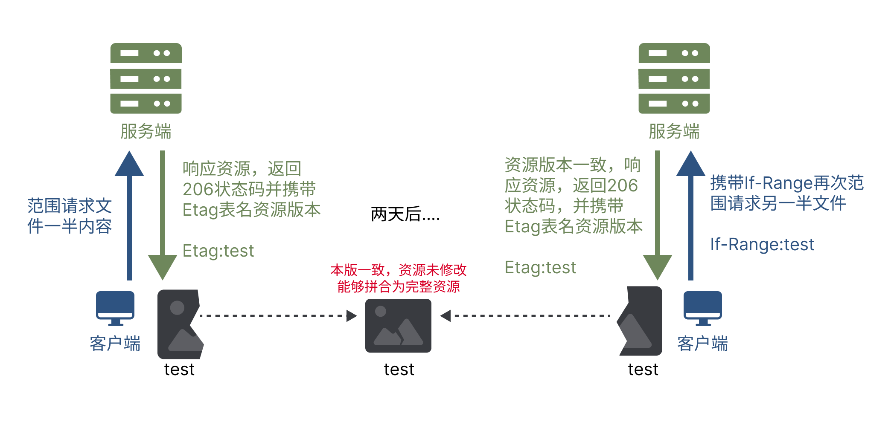

# 范围请求

**范围请求是HTTP的一种内容协商机制，该机制允许客户端只请求资源的部分内容**。范围请求在传送大的媒体文件，或者与文件下载的断点续传功能搭配使用时非常有用。


## 范围请求的工作流程

范围请求通过在HTTP请求标头`Range`中表明需要请求的部分资源的字节范围，服务器收到请求后将判断`Range`指定的范围是否超出资源的大小。如果范围未超出资源大小，服务器将响应 `206 Partial Content` 状态码，以及`Range`标头指定的资源的部分内容，并携带`Content-Range`响应头表明返回部分资源的字节范围/整体资源大小；如果所请求的范围越界，那么服务器会返回 `416 Requested Range Not Satisfiable` （请求的范围无法满足）状态码，表示客户端错误。如果事先不知资源能否范围请求，还需要事先发送一个`head`请求进行检测。



范围请求工作流程如下：

- **未知资源能否发起范围请求（已知忽略该步）**：对请求资源发起一个head请求，检测能否使用范围请求。

- **服务端响应head请求（已知忽略该步）**：服务端收到head请求后，只会返回响应头部信息，而不返回实际的资源内容。**如果返回头部信息中有包含`Accept-Ranges: bytes`头，则证明该资源支持范围请求，同时还会包含一个`Content-Length`头，该头表明了资源的整体大小；如果未包含`Accept-Ranges: bytes`则表明不支持范围请求**。

- **客户端发起范围请求**：客户端携带`Range`请求标头，表明需要请求的部分资源的字节范围。**客户端不仅仅只能指定请求资源的某一部分（单一范围），还可以指定请求资源的多个部分（多重范围）**。

  > 单一范围请求/示例

  ```http
  GET /image.png HTTP/1.1
  Range: bytes=0-1023
  ```

  > 多重范围请求示例

  ```http
  GET /image.png HTTP/1.1
  Range: bytes=0-1023, 2000-6576
  ```

- **服务端响应范围请求**：服务端收到范围请求后，将判断请求资源是否存在`Range`中指定的字节范围，如果存在，服务端将正确处理请求，并只返回该范围内的数据，携带`Content-Range`响应头表明返回部分资源的字节范围/整体资源大小，携带`Content-Length`响应头表示响应的响应体的大小，使用`206 Partial Content` 状态码来指示成功响应请求的部分内容。如果所请求的范围越界，那么服务器会返回 `416 Requested Range Not Satisfiable` （请求的范围无法满足）状态码，表示客户端错误。

  > 单一范围请求响应示例

  ```http
  HTTP/1.1 206 Partial Content
  Content-Range: bytes 0-1023/146515
  Content-Length: 1024
  ...
  (binary content)
  ```

  > 多重范围请求响应示例

  ```http
  HTTP/1.1 206 Partial Content
  Content-Type: multipart/byteranges; boundary=3d6b6a416f9b5
  Content-Length: 2082
  --3d6b6a416f9b5
  Content-Type: image/png
  Content-Range: bytes 0-1000/146515
  (binary content)
  --3d6b6a416f9b5
  Content-Type: image/png
  Content-Range: bytes 2000-3000/146515
  (binary content)
  --3d6b6a416f9b5
  ```

  ::: danger 上述多重范围请求响应示例中，请求的资源范围总共为2000bytes，为什么`Content-Length`却为2082bytes?

  `Content-Length`这个值不仅仅包括消息体的实际数据（即两个`image/png`部分），还包括了`multipart`格式的边界、每个部分的头部和可能的空行等。其次，每个部分（在这里是两个`image/png`部分）都有自己的`Content-Type`和`Content-Range`头部，这些头部的大小也要计入`Content-Length`中。

  :::

  与范围请求相关的三种响应状态：

  - 在请求成功的情况下，服务器会返回 `206 Partial Content` 状态码。
  - 在请求的范围越界的情况下（范围值超过了资源的大小），服务器会返回 `416 Requested Range Not Satisfiable` （请求的范围无法满足）状态码。
  - 在不支持范围请求的情况下，服务器会返回 `200 OK` 状态码。

  


## 保障资源完整性

范围请求每次都只请求资源的部分内容，那么如何保障两次请求的资源未发生过更改呢？如何保障资源的完整性呢？比如我使用范围请求请求了资源的一半内容，过了两天之后，我又继续使用范围请求请求资源的另一半内容，此时我是无法确认我请求的另一半资源未发生过更改，且无法保障两份资源能够拼合在一起还原为一份完整资源。



为解决该问题，HTTP协议规定了一个特定的请求头 `If-Range`——来避免这种情况的发生。使用`If-Range`请求头与`Etag`响应头搭配使用，即可对请求资源进行版本验证；使用`If-Range`请求头与`Last-Modified`响应头搭配使用，即可对请求资源进行时间验证。

#### 基于时间的验证——Last-Modified/If-Range



当客户端首次发起范围请求请求资源部分内容时，**服务器的响应会携带`Last-Modified`响应标头来表明请求资源最后被修改的时间，通常情况下，服务器会根据文件系统中资源的最后修改时间自动设置这个标头。** 如下所示：

```http
HTTP/1.1 206 Partial Content
Content-Range: bytes 0-1023/146515
Content-Length: 1024
Last-Modified: Tue, 22 Feb 2022 22:00:00 GMT
........
```

**客户端收到响应后需要自行将这个时间存储起来，后续客户端再次对该资源进行范围请求时，需要自行携带一个`If-Range`请求头，并将保存的时间值放入其中，以告诉浏览器，上一次范围请求请求的资源最后被修改的时间**，如下所示：

```http
GET /image.png HTTP/1.1
Range: bytes=1024-2047
If-Range: Tue, 22 Feb 2022 22:00:00 GMT
......
```

**服务器收到该请求后会比较请求中的 `If-Range` 值与当前资源的最后修改时间，如果内容自指定时间以来没有更改，则证明资源未发生更改，此时浏览器会返回状态码为`206 Partial` 的响应，以及相应的部分资源；如果请求资源发生了更改，那么就会返回状态码为 `200 OK` 的响应，同时返回整个资源。**

> `If-Range`值与当前资源的最后修改时间相同的响应

```HTTP
HTTP/1.1 206 Partial Content
Content-Range: bytes 1024-2047/146515
Content-Length: 1024
Last-Modified: Tue, 22 Feb 2022 22:00:00 GMT
........
```

> `If-Range`值与当前资源的最后修改时间不同的响应

```http
HTTP/1.1 200 ok
Last-Modified: Tue, 23 Feb 2022 22:00:00 GMT
Content-Length: 146515
.................
```

基于时间的验证虽然保证了资源的一致性与完整性问题，但它也存在诸多问题：

- **时间精度问题：** 时间戳通常只有秒级别的精度，这可能导致在某些情况下无法检测到资源的真正修改。如果两次修改之间的时间间隔很短，可能无法捕捉到变化。
- **服务器时钟回退：** 如果服务器的时钟回退（例如，由于时钟同步服务的干预），可能会导致客户端认为资源已经过期，尽管实际上它仍然是最新的。
- **资源未被修改但最后修改时间已变：** 有时资源的内容并没有实际修改，但由于某些原因，最后修改时间被更新了。这可能导致不必要的资源传输。

为了解决这些问题，HTTP缓存推出了基于版本的验证作为替代方案。


#### 基于版本的验证——ETag/If-Range



当客户端首次发起范围请求请求资源部分内容时，**服务器的响应会携带`ETag`响应标头来表明请求资源的版本**，该标头的值是服务器生成的任意值，因此服务器可以根据他们选择的任何方式自由设置值——例如主体内容的哈希或版本号，如下所示：

```http
HTTP/1.1 206 Partial Content
Content-Range: bytes 0-1023/146515
Content-Length: 1024
ETag: "deadbeef"
........
```

**客户端收到响应后需要自行将`ETag`的值存储起来，后续客户端再次对该资源进行范围请求时，需要自行携带一个`If-Range`请求头，并将保存的`ETag`值放入其中，以告诉浏览器，上一次范围请求请求的资源的版本**，如下所示：

```http
GET /image.png HTTP/1.1
Range: bytes=1024-2047
If-Range: "deadbeef"
......
```

**服务器收到该请求后会比较请求中的 `If-Range` 值与当前资源版本号是否相同，如果当前资源版本号与请求中的`If-Range`  值相同，则证明资源未发生更改，此时浏览器会返回状态码为`206 Partial` 的响应，以及相应的部分资源；如果当前资源版本号与请求中的`If-Range`  值不同，那么就会返回状态码为 `200 OK` 的响应，同时返回整个资源。**

> `If-Range`值与当前资源版本相同的响应

```HTTP
HTTP/1.1 206 Partial Content
Content-Range: bytes 1024-2047/146515
Content-Length: 1024
ETag: "deadbeef"
........
```

> `If-Range`值与当前资源版本不同的响应

```http
HTTP/1.1 200 ok
ETag: "sdaeadbeef"
Content-Length: 146515
.................
```

::: danger `If-Range`不能与`Last-Modified`、`ETag`同时使用

`If-Range`请求标头可以与`Last-Modified`响应标头搭配组成基于时间的验证，也可以与`ETag`响应标头搭配组成基于版本的验证，但不能同时与`Last-Modified`、`ETag`同时使用。

:::


## 相关标头


### Accept-Ranges `响应标头`

**响应标头`Accept-Ranges`表示请求资源是否支持范围请求**。当浏览器发现`Accept-Ranges`头时，可以尝试*继续*中断了的下载，而不是重新开始。

**参数**

该响应标头并无其他参数

**取值**

- **none**

  表示不支持任何范围请求，由于其等同于没有返回此头部，因此很少使用。

- **bytes**

  表示支持范围请求，其范围单位为bytes(字节)

**示例**

```http
Accept-Ranges: bytes
```


### Content-Length `实体标头`

**实体标头`Content-Length`表示消息主体的大小，用来指明发送给接收方的消息主体的大小，单位为bytes(字节)**。

**参数**

该实体标头并无其他参数

**取值**

- **\<length>**

  十进制数字，表明消息体的长度，单位为bytes(字节)。

**示例**

```http
Content-Length:1024
```


### Range `请求标头`

**请求标头`Range`指定了一系列的字节范围，用于告知服务器客户端需要请求资源哪些部分的内容**。如果范围未超出资源大小，服务器将响应 `206 Partial Content` 状态码，以及`Range` 头字段请求的相应部分，如果所请求的范围不合法，那么服务器会返回 `416 Range Not Satisfiable` 状态码，表示客户端错误。

**参数**

该请求标头并无其他参数

**取值**

- **\<unit>=[\<star-end>,\<start->......]**

  **\<unit>：** 范围所采用的单位，通常是字节（bytes）。

  **start：** 一个整数，表示范围的起始值。

  **end：** 一个整数，表示范围的结束值，如果不存在，表示此范围一直延伸到文档结束。

**示例**

```http
Range: bytes=200-1000, 2000-6576, 19000-
```


### Content-Range `响应标头`

响应标头`Content-Range`表示响应的部分资源的字节范围，以及资源的整体大小。

**参数**

该响应标头并无其他参数

**取值**

- **\<unit> \<star-end>/\<size>**

  **\<unit>：** 范围所采用的单位，通常是字节（bytes）。

  **start：** 一个整数，表示范围的起始值。

  **end：** 一个整数，表示范围的结束值。

  **size：** 资源的整体大小。

**示例**

```http
Content-Range: bytes 200-1000/67589
```


### If-Range `请求标头`

**请求标头`If-Range`当与`Last-Modified`响应标头搭配时，需要指定一个绝对时间，通过检查资源的最后修改时间是否更改，来检查资源是否发生变化；当与`Etag`响应标头搭配时，需要指定一个版本号，通过检查资源是否与给定版本号匹配，来检查资源是否发生更改**。

当资源未发生更改服务器才会回复`206 Partial Content`状态码，以及`Range` 头字段请求的相应部分；如果资源发生更改，服务器将会返回 `200 OK` 状态码，并返回完整的请求资源。

**参数**

该请求标头并无其他参数。

**取值**

- **\<date>**

  指定一个绝对时间，表示希望服务器检查资源的最后修改时间是否更改，也就是检查资源是否发生变化。

- **"<etag_value>"**

  指定一个版本号，表示希望服务器检查资源是否与给定版本号匹配，也就是检查资源是否发生变化。

**示例**

```http
If-Range: Wed, 21 Oct 2015 07:28:00 GMT
If-Range: "deadbeef"
```


### Last-Modified `响应标头`

**响应标头`Last-Modified`指定了响应的资源最后被修改的时间，通常情况下，服务器会根据文件系统中资源的最后修改时间自动设置这个标头。**

**参数**

该响应标头并无其他参数。

**取值**

- **\<date>**

  一个绝对时间，指定响应的资源最后被修改的时间。

**示例**

```http
Last-Modified: Wed, 21 Oct 2015 07:28:00 GMT
```


### ETag `响应标头`

**响应标头`ETag`指定了一个版本号，表明响应的资源的版本**，该标头的值是服务器生成的任意值，因此服务器可以根据他们选择的任何方式自由设置值——例如主体内容的哈希或版本号。

**参数**

- **W/** `可选`

  `'W/'`(大小写敏感) 表示使用[弱验证器](https://developer.mozilla.org/zh-CN/docs/Web/HTTP/Conditional_requests#weak_validation)。弱验证器很容易生成，但不利于比较。强验证器是比较的理想选择，但很难有效地生成。相同资源的两个弱`Etag`值可能语义等同，但不是每个字节都相同。

- **"<etag_value>"**

  指定一个版本号，没有明确指定生成 ETag 值的方法。通常，使用内容的散列，最后修改时间戳的哈希值，或简单地使用版本号。例如，MDN 使用 wiki 内容的十六进制数字的哈希值。

**示例**

```http
ETag: "33a64df551425fcc55e4d42a148795d9f25f89d4"
ETag: W/"0815"
```


## 本节参考

- https://developer.mozilla.org/zh-CN/docs/Web/HTTP/Range_requests
- https://developer.mozilla.org/zh-CN/docs/Web/HTTP/Headers/Accept-Ranges
- https://developer.mozilla.org/zh-CN/docs/Web/HTTP/Headers/Range
- https://developer.mozilla.org/zh-CN/docs/Web/HTTP/Headers/Content-Range
- https://developer.mozilla.org/zh-CN/docs/Web/HTTP/Headers/Last-Modified
- https://developer.mozilla.org/zh-CN/docs/Web/HTTP/Headers/ETag
- https://developer.mozilla.org/zh-CN/docs/Web/HTTP/Headers/If-Range

转载需要经过本人同意，并标明出处！