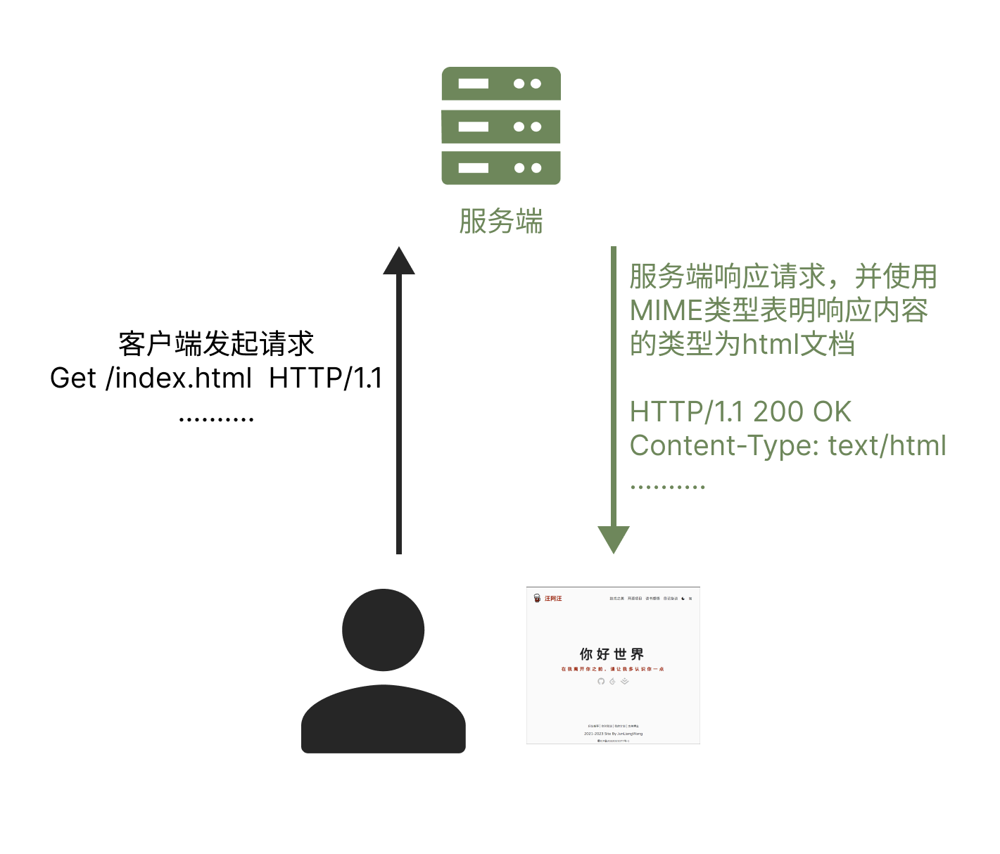

# MIME类型

**MIME类型，也被称为媒体类型，用于表示HTTP传输的内容的类型，以便客户端或服务端正确处理解析传输的数据**。MIME类型通常在HTTP标头中的`Content-Type`字段中进行指定，例如下面的示例，如果要传输HTML文档，`Content-Type`头可能会设置为"text/html"。



## MIME类型的结构

MIME 类型通常包含三个部分内容：类型（type）、子类型（subtype）、以及一个可选的参数（parameter=value），类型与子类型中间由斜杠 `/` 分割，而可选参数则使用`；`分割，中间没有空白字符。

```http
type/subtype;parameter=value
```

- **类型（type）**：代表数据类型所属的大致分类，例如：视频数据的类型为`video` ，文本数据的类型为 `text`。
- **子类型（subtype）**：代表更确切的数据类型，以 `text` 类型为例，它的子类型包括：`plain`（纯文本）、`html`（HTML源代码）、`calender`（iCalendar/.ics文件）。
- **可选的参数（parameter=value）**：提供额外的信息，例如`text`  类型，可以添加可选的 `charset` 参数（charset=utf-8），以指定数据中的字符所使用的字符集。

::: danger MIME 类型对大小写不敏感，但是传统写法都是小写，参数值对大小写敏感。

:::


## 类型(type)的分类

单一/多部分类型


## 常见的MIME类型


## 正确设置MIME类型的重要性


## MIME嗅探


## 其他传送文件类型的方法