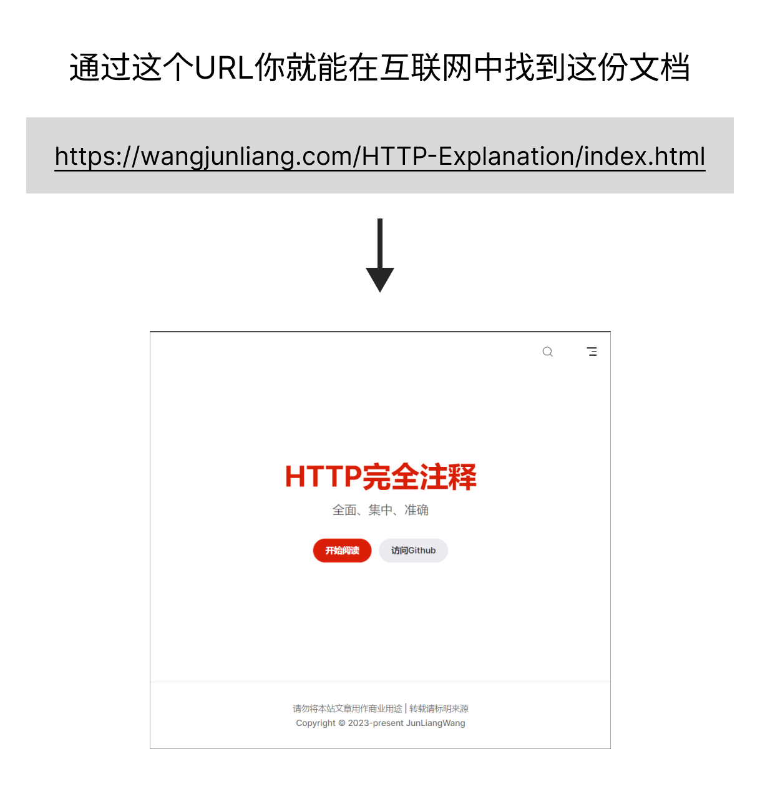
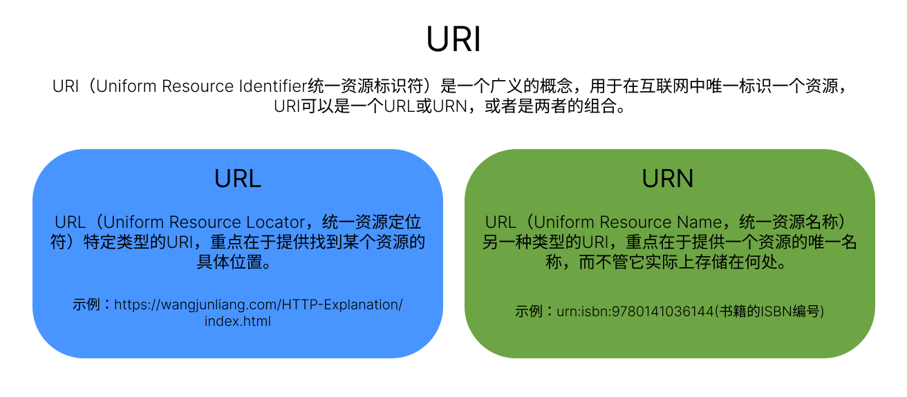

# URL

HTTP 请求的内容被称为"资源"。”资源“这一概念非常宽泛，它可以是一份文档，一张图片，或所有其他你能够想到的格式。每个资源的名称和位置由一个 URL（统一资源定位符，它是 URI 的一种）来标识，URL你可以看作资源的地址，通过URL我们就可以在互联网中找到具体的资源。




## URI、URL、URN的关系

URL（Uniform Resource Locator，统一资源定位符）和URN（Uniform Resource Name，统一资源名称）是URI（Uniform Resource Identifier，统一资源标识符）的子集。它们都是用于在互联网中标识资源，不过其侧重点不同。



- **URI（Uniform Resource Identifier，统一资源标识符）**：它是一个广义的概念，用于唯一标识一个互联网中的资源。URI可以是一个URL或URN，或者是两者的组合。
- **URL（Uniform Resource Locator，统一资源定位符）**：特定类型的URI，重点在于提供找到某个资源的具体位置。它通常包含协议（如HTTP、FTP），服务器地址，以及资源在服务器上的具体路径。例如，`http://www.example.com/path/to/file` 就是一个URL。
- **URN（Uniform Resource Name，统一资源名称）**：另一种类型的URI，重点在于提供一个资源的唯一名称，而不管它实际上存储在何处。URN是持久的、位置独立的资源标识符。例如，一个书籍的ISBN编号就可以视为一种URN。


## URL的组成

URL由协议、主机、端口号(可选)、资源路径、查询(可选)、片段(可选)组成。

```
协议://主机:端口号/资源路径?查询#片段
```


### 协议


告诉浏览器使用何种协议，对于大部分 Web 资源，通常使用 HTTP 协议或HTTPS 协议，此外，浏览器也知道如何处理其他协议。例如， `mailto` 协议指示浏览器打开邮件客户端；`ftp`协议指示浏览器处理文件传输。常见的协议有：

| 协议        | 描述                                                         |
| ----------- | ------------------------------------------------------------ |
| data        | 允许内容创建者使用data URI向文档直接嵌入小文件（如小图像、简单文本），而无需通过外部文件引用。 |
| file        | 用于访问本地计算机上的文件，它允许浏览器从用户的文件系统中直接读取文件。 |
| http/https  | 超文本传输协议，用于在Web上传输信息。                        |
| mailto      | 用于创建发送电子邮件的链接，点击这样的链接会打开用户的默认邮件客户端，并创建一封新邮件，收件人地址已预填写。 |
| tel         | 用于拨打电话号码，点击这样的链接可以在支持此功能的设备上启动电话拨号程序。 |
| view-source | 用于查看网页的源代码，在大多数浏览器中，前置 `view-source:` 到任何URL，可以直接查看该网页的HTML、CSS和JavaScript代码。 |
| ws/wss      | 用于在客户端和服务器之间建立一个全双工、持久的连接通道。     |

### 域名


## 常见的协议

### data协议

### file协议

### view-source协议

### ws/wss协议