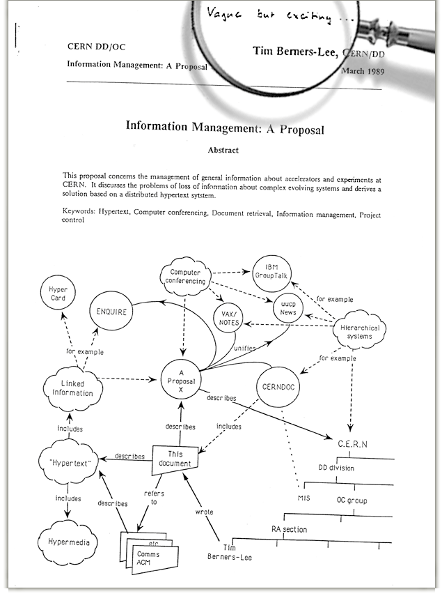

# HTTP的历史

**超文本传输协议**（英语：**H**yper**T**ext **T**ransfer **P**rotocol，缩写：**HTTP**）是[万维网](https://zh.wikipedia.org/wiki/%E4%B8%87%E7%BB%B4%E7%BD%91)（World Wide Web）的基础协议。自[蒂姆·伯纳斯-李 ](https://zh.wikipedia.org/wiki/提姆·柏內茲-李)（Tim BernersLee）博士和他的团队在 1989-1991 年间创造出它以来，HTTP 已经发生了太多的变化，在保持协议简单性的同时，不断扩展其灵活性。如今，HTTP 已经从一个只在实验室之间交换文档的早期协议进化到了可以传输图片，高分辨率视频和 3D 效果的现代复杂互联网协议。


## HTTP的诞生

1989 年 3 月[欧洲核子研究组织](https://zh.wikipedia.org/wiki/歐洲核子研究組織)（CERN）的[蒂姆·伯纳斯-李 ](https://zh.wikipedia.org/wiki/提姆·柏內茲-李)（Tim BernersLee）博士提出了一种能让远隔两地的研究者们共享知识的设想。 最初设想的基本理念是：借助多文档之间相互关联形成的超文本（HyperText），连成可相互参阅的 WWW（World Wide Web，万维网）。



<P align=center style="color:gray">蒂姆最初的提议。图片来源：欧洲核子研究中心</p>

到 1990 年 10 月，Tim 编写了三项基本技术来实现设想，这些技术仍然是当今网络的基础（您可能已经在网络浏览器的某些部分上看到过这些技术）：

- HTML（HyperText Markup Language）：超文本标记语言，作为编写文档的语言。
- HTTP（HyperText  Transfer Protocol）：超文本传输协议，作为传递文档的协议。
- URL（Uniform Resource Locator）：统一资源标识符，一种唯一的“地址”，用于标识文档在网络上的位置。

此外 Tim 还编写了第一个网页编辑器/浏览器（“WorldWideWeb.app”）和第一个 Web 服务器（“httpd”）。至此 Tim 初步完成了他的设想的所有技术实现，且第一批服务器已经在 1991 年初在 CERN 以外的地方运行了，1991 年 8 月 16 日，Tim Berners-Lee 在公开的超文本新闻组上[发表](https://www.w3.org/People/Berners-Lee/1991/08/art-6484.txt)的文章被视为是万维网公共项目的开始。


对于HTTP而言， 在应用的早期阶段它是非常简单的，后来它也被称为 HTTP/0.9，有时也叫做单行hang（one-line）协议。


## HTTP/0.9——单行协议(1991)

最初版本的 HTTP 协议并没有版本号，后来它的版本号被定位在 0.9 以区分后来的版本。[HTTP/0.9](https://www.w3.org/Protocols/HTTP/AsImplemented.html)于 1991 年提出。它是有史以来最简单的协议；它的请求由单行指令构成（因此也称为单行协议），以唯一可用方法 [`GET`](https://developer.mozilla.org/zh-CN/docs/Web/HTTP/Methods/GET) 开头，其后跟目标资源的路径（一旦连接到服务器，协议、服务器、端口号这些都不是必须的）。

```http
GET /index.html
```

响应也极其简单的：只包含HTML文档本身。

```html
<HTML>
这是一个非常简单的 HTML 页面
</HTML>
```

跟后来的版本不同，HTTP/0.9 的响应内容并不包含 HTTP 头。这意味着只有 HTML 文件可以传送，无法传输其他类型的文件。也没有状态码或错误代码。一旦出现问题，一个特殊的包含问题描述信息的 HTML 文件将被发回，供人们查看。

### 特性

- 它是 ASCII 协议，请求/响应都是由ASCII字符组成字符串。
- 它在TCP/IP 链路上运行。

- 请求以回车符 (CRLF) 终止。

- 响应只包含HTML文档。
- 文档传输完成后，TCP连接将终止。

### 缺陷

- **只支持GET请求：** HTTP/0.9仅支持GET方法，意味着只能用于获取资源，不能用于其他类型的请求，如POST、PUT、DELETE等。这导致在处理复杂的应用逻辑和实现数据更新等操作时，HTTP/0.9显得非常有限。
- **只能传输HTML：** HTTP/0.9的响应只能包含HTML文档，无法处理其他类型的数据，如JSON、XML、图像等。这限制了其在处理现代Web应用程序中的数据传输和交互能力。
- **无法进行内容协商：** HTTP/0.9没有头部信息，无法携带元数据，如Content-Type、Content-Length等，这使得它无法识别并正确解析其他响应内容。
- **没有状态码或错误代码：** 也是由于HTTP/0.9没有头部信息，无法携带元数据，因此响应成功与失败都是返回HTML文档，这使得浏览器不能知晓请求执行成功或失败，并相应调整行为。
- **不支持持久连接：** 在HTTP/0.9中，每次请求都会建立一个新的TCP连接，请求完成后立即关闭连接。这导致在处理大量请求时，频繁地建立和关闭连接会带来较大的开销，影响性能。
- **安全性问题：** HTTP/0.9没有提供任何加密和安全机制，所有的数据都是明文传输。这使得数据容易受到窃听和篡改，缺乏对隐私和数据完整性的保护。
- **只能传输英文文本数据：** HTTP/0.9默认采用的字符集是ASCII字符集，这意味着HTTP只能传输英文文本数据，无法支持其他语言的文本数据，比如包含非英文字符的文本（如中文、日文、俄文等）。

正如你们所看到的，HTTP/0.9仅适用于简单的、仅需要获取HTML文档的场景。新兴 Web 所需功能及其在公共 Web 上的用例不断增长，很快就强化了 HTTP 0.9 的许多缺陷：我们需要一个协议，该协议不仅可以服务于超文本文档，还可以提供有关请求和响应的更丰富的元数据。

很快，HTTP 的下一个版本（即 HTTP/1.0）被推出，它解决了HTTP/0.9的缺陷，并提供更多强大的功能和性能优化。


## HTTP/1.0——构建可扩展性(1996)

1996 年 5 月，HTTP 工作组 (HTTP-WG) 发布了 [RFC 1945](https://datatracker.ietf.org/doc/html/rfc1945)，文档 [RFC 1945](https://datatracker.ietf.org/doc/html/rfc1945) 定义了 HTTP/1.0，但它是狭义的，并不是官方标准。

HTTP/1.0 通过定义了HTTP请求/响应的结构，加入许多头部信息，现在可以处理其他响应格式，即图像、视频文件、纯文本或任何其他内容类型。它添加了更多方法（即 POST 和 HEAD）、添加了状态代码来标识响应、引入了字符集、类型、授权、缓存、内容编码等内容。

以下为 HTTP/1.0 的请求示例：

```http
GET / HTTP/1.0
Host: cs.fyi
User-Agent: Mozilla/5.0 (Macintosh; Intel Mac OS X 10_10_5)
Accept: */*
```

以下为 HTTP/1.0 的响应示例：

```http
HTTP/1.0 200 OK 
Content-Type: text/plain
Content-Length: 137582
Expires: Thu, 05 Dec 1997 16:00:00 GMT
Last-Modified: Wed, 5 August 1996 15:55:28 GMT
Server: Apache 0.84

(response body)
(connection closed)
```

HTTP/1.0 的请求与响应现在看起来也是非常熟悉的，因为它首次定义了请求/响应的格式我们沿用至今，并且由于加入头信息，使得内容协商变得容易起来，这也极大的丰富了它的扩展性，虽然请求和响应标头仍保留为 ASCII 编码，但响应正文可以是任何类型，即图像、视频、HTML、纯文本或任何其他内容类型。因此，现在服务器不仅仅只能向客户端发送HTML文档，还可以发送其他任何内容类型；推出后不久，HTTP 中的“超文本”一词就变得用词不当。HMTP 或超媒体传输协议可能更有意义，但我想，我们终生都坚持这个名字。

:::  tip 请求与响应头仍是ASCII编码，那么其中的中文是如何处理的呢？

我们都知道ASCII编码仅表示了英文小大写、数字以及一些标点符号，对于其他国家的语言是并不支持的，那么请求头中的其他国家的语言的信息如何处理呢？

> 我尝试使用浏览器访问以中文命名的HTML，URL：[wangjunliang.com/我想看看.html](https://wangjunliang.com/我想看看.html)

```http
请求网址:
https://www.wangjunliang.com/%E6%88%91%E6%83%B3%E7%9C%8B%E7%9C%8B.html
请求方法:
GET
状态代码:
200
远程地址:
127.0.0.1:7890
引荐来源网址政策:
strict-origin-when-cross-origin
```

惊奇的发现在请求头中`我想看看`转换为了`%E6%88%91%E6%83%B3%E7%9C%8B%E7%9C%8B`，这就是传说中的URL编码。

**URL编码：** URL 编码是一种将特殊字符和非 ASCII 字符转换为 ASCII 字符的方法，使它们能够在 HTTP 请求的 URL 中进行传输。具体而言，URL 编码使用 "%" 符号后跟两个十六进制数字来表示一个字符。例如，中文字符 "中" 的 URL 编码表示为 "%E4%B8%AD"。这个编码表示了字符 "中" 在 ASCII 字符集中的十六进制表示。当 HTTP/1.0 的请求或响应中包含中文字符时，这些字符会被转换成对应的 URL 编码形式。服务器收到 URL 编码后的请求后，会将其还原为原始的中文字符进行处理。需要注意的是，HTTP/1.0 的 URL 编码仅适用于 URL 中的字符编码。

:::

### 特性

- **定义了请求/响应格式：** HTTP/1.0将请求/响应格式划分为了三个部分——起始行、头部信息、消息体，这个格式一直沿用至今。
- **加入了状态码和状态描述：** 在响应的起始行中加入了状态代码和状态的描述信息，提供了关于请求处理结果的信息，以便客户端和服务器能够进行适当的处理和决策。
- **加入了内容协商：** 虽然在HTTP/1.0中起始行与头部信息都保留为 ASCII 编码，但它通过加入了Content-Type、Content-Length、Transfer-Encoding等头部属性，可以对不同类型的文件在消息体中进行不同的编码。也就是说起始行、头部信息传输仍是ASCII编码，而消息体则会根据头部属性让客户端/服务器进行内容协商，进行不同的编码方式。
- **可以传输任何文件：** 由于HTTP/1.0加入了内容协商的机制，使得只要客户端/服务器协商一致，HTTP/1.0就可以传输任何形式的文件。
- **新增POST、HEAD请求：** POST请求方法允许客户端向服务器提交数据，而HEAD请求方法允许客户端获取资源的元数据。这些新增的请求方法丰富了HTTP协议的能力，使得客户端和服务器能够进行更多样化的交互和处理。
- **不再只是传输英文文本数据：** HTTP/1.0引入字符集（Character Set），解决了其他国家语言文本数据的字符编码问题，并确保文本数据能够以正确的方式被处理和显示。
- **初步引入缓存概念：** HTTP/1.0引入了头部字段如Expires和Last-Modified，用于控制缓存的行为，以及头部字段如If-Modified-Since和If-None-Match，用于条件性请求。
- **初步引入持久链接：** HTTP/1.0引入一个名为 Connection: keep-alive 的新标头，来保持请求建立起来的TCP连接，以供后续请求继续使用该链接完成请求。
- **初步引入代理支持：** HTTP/1.0引入了Proxy-Connection头部字段来指示代理服务器是否应保持持久连接，并引入了Via头部字段，用于标识请求经过的代理服务器链。

### 缺陷

- **持久链接未得到广泛支持，默认仍为短连接：** HTTP/1.0 的尝试通过引入一个名为 Connection: keep-alive 的新标头来克服短连接问题，但它仍然没有得到广泛的支持，问题仍然存在。
- **请求阻塞：** 在HTTP/1.0中，每个请求都需要按照顺序进行，即必须等待前一个请求的响应返回后才能发送下一个请求。如果前一个请求很耗时，会导致后续请求被阻塞，影响并发性能。
- **无状态：** HTTP是一种无状态协议，即服务器不维护有关客户端的信息，当客户端需要记录状态时，必须发送一些记录状态的冗余数据，从而导致带宽使用量增加。

- **缺乏压缩支持：** HTTP/1.0没有内置的数据压缩机制，因此在传输大量文本数据时，没有有效地压缩数据，增加了网络传输的开销。

- **安全性问题：** HTTP/1.0没有提供任何加密和安全机制，所有的数据都是明文传输。这使得数据容易受到窃听和篡改，缺乏对隐私和数据完整性的保护。
- **实现混乱：** 由于HTTP/1.0并不是官方标准，许多浏览器厂商并没有按照HTTP/1.0的指导实现HTTP，导致在实际运用中混乱不堪。

可以看到对于HTTP/0.9人们诟病的是它的文件类型支持不够丰富，由于它的文件类型支持不丰富，所有通常只是请求HTML文档，往往发送一次请求就能获取到完整的内容。而在HTTP/1.0丰富了文件类型后，一次请求不再能获取到全部内容，并且请求的内容也从较小的HTML文档发展到了图片、音频、视频等较大的文件，此时HTTP的性能问题也被暴露出来。

此外，由于各个浏览器相互竞争，各自为战，并且HTTP/1.0并不是官方标准，只是一些指导意见。这导致各个厂商对于HTTP都有各自的实现方式，导致在实际运用中混乱不堪。

由于上述原因，人们迫切需要优化HTTP性能，制定一份标准化HTTP协议！


## HTTP/1.1——标准化的协议(1997)

HTTP/1.0 多种不同的实现方式在实际运用中显得有些混乱。自 1995 年开始，即 HTTP/1.0 文档发布的下一年，就开始修订 HTTP 的第一个标准化版本。 在 1997 年 1 月HTTP1.1 标准以 [RFC 2068](https://datatracker.ietf.org/doc/html/rfc2068) 文件发布，后续 HTTP/1.1 协议进行过两次修订，分别是[RFC 2616](https://datatracker.ietf.org/doc/html/rfc2616) 发布于 1999 年 6 月，以及 [RFC 7230](https://datatracker.ietf.org/doc/html/rfc7230)-[RFC 7235](https://datatracker.ietf.org/doc/html/rfc7235) 发布于 2014 年 6 月。

HTTP/1.1 标准消除了早期版本中大量歧义内容，并引入了许多关于性能优化的措施：持久链接、管道化技术、支持范围请求和部分响应、分块传输机制、明确缓存控制机制、增加压缩技术、增强内容协商机制、增加客户端cookie等。除了改进HTTP性能方面HTTP/1.1还新增状态码、引入了基本认证和摘要认证，提供更强大的用户认证机制，确保更安全的通信、 引入了 Host 头字段，该字段允许在同一个物理服务器上托管多个域名。这使得虚拟主机能够通过在 Host 头中指定域名来区分不同的网站、并且它还新增了许多请求方法，极大丰富了请求类型。

> 以下为HTTP/1.1的请求示例

```http
GET /zh-CN/docs/Glossary/Simple_header HTTP/1.1
Host: developer.mozilla.org
User-Agent: Mozilla/5.0 (Macintosh; Intel Mac OS X 10.9; rv:50.0) Gecko/20100101 Firefox/50.0
Accept: text/html,application/xhtml+xml,application/xml;q=0.9,*/*;q=0.8
Accept-Language: en-US,en;q=0.5
Accept-Encoding: gzip, deflate, br
Referer: https://developer.mozilla.org/zh-CN/docs/Glossary/Simple_header
```

> 以下为HTTP/1.1的响应示例

```http
200 OK
Connection: Keep-Alive
Content-Encoding: gzip
Content-Type: text/html; charset=utf-8
Date: Wed, 20 Jul 2016 10:55:30 GMT
Etag: "547fa7e369ef56031dd3bff2ace9fc0832eb251a"
Keep-Alive: timeout=5, max=1000
Last-Modified: Tue, 19 Jul 2016 00:59:33 GMT
Server: Apache
Transfer-Encoding: chunked
Vary: Cookie, Accept-Encoding
```

我们可以看到在请求/响应格式上HTTP/1.1与HTTP/1.0并无差异，这是因为HTTP/1.1沿用了HTTP/1.0的请求/响应格式。

### 特性

- **持久化连接：** 在HTTP/1.0中持久连接默认为关闭，并没有得到广泛应用，而在HTTP/1.1中连接默认情况下不会关闭，而是保持打开状态，从而允许多个顺序请求。要关闭连接，请求头 Connection: close 必须可用。客户端通常在最后一个请求中发送此标头以安全地关闭连接。
- **管道化技术：** HTTP/1.1引入了管道化技术，以解决请求阻塞问题，客户端可以在同一连接上向服务器发送多个请求，而无需等待服务器的响应，并且服务器必须按照接收请求的顺序发送响应。
- **新增客户端Cookie：** 由于HTTP是无状态协议，当客户端需要记录状态时，必须发送一些记录状态的冗余数据，从而导致带宽使用量增加。HTTP/1.1引入了客户端cookie以解决该问题，通过在浏览器中设置cookie，服务器可以跟踪用户会话状态，实现用户身份认证，个性化用户体验等。
- **新增Gzip、Deflate等压缩技术：** 在HTTP/1.1中，服务器可以使用Gzip、Deflate等压缩算法来压缩HTTP响应的实体主体部分（如HTML、CSS、JavaScript等），然后在响应头中使用"Content-Encoding"字段来指示客户端该响应已经被压缩以及压缩的算法。客户端收到压缩的响应后，会自动解压缩以获取原始内容。
- **引入了基本认证和摘要认证机制：** 在HTTP/1.1中，可以通过基本认证和摘要认证机制，在请求头中传递用户名和密码等凭据进行用户身份验证。
- **引入了范围请求和部分响应机制：** HTTP/1.1引入了范围请求和部分响应的功能，通过在HTTP请求头中使用"Range"字段指定所需的资源范围，而服务器在响应头中使用"206 Partial Content"状态码表明返回的是部分响应，并通过"Content-Range"字段指示返回内容的字节范围。这使得客户端可以请求大文件的特定部分，例如断点续传的情况下，从而避免重新下载整个文件。此外，范围请求还能让客户端只获取媒体资源的特定片段，优化数据传输并提升用户体验。
- **引入了分块传输机制：** HTTP/1.1引入了分块传输（Chunked Transfer Encoding）机制，用于在动态内容传输时，服务器无法提前确定整个内容的长度的情况下，逐块发送内容。在分块传输中，服务器将响应拆分为一系列块，每个块都有一个独立的大小，并使用"Transfer-Encoding: chunked"请求头来通知客户端有关分块传输的信息。客户端接收到该头信息后，知道响应将以分块的形式传输，它可以按照指定的块大小逐块接收内容，直到接收到一个长度为零的块，表示传输已完成。这种机制适用于动态生成内容、流式传输以及服务器长时间运行的响应等场景，提供了更灵活和高效的数据传输方式。
- **明确缓存机制：** HTTP/1.1在HTTP/1.0的基础上进一步明确了缓存机制，服务器可以通过设置响应头字段来控制缓存行为，例如使用"Cache-Control"头字段来指定缓存策略，如"max-age"用于设置资源的最大缓存时间，"no-cache"用于要求客户端验证资源的有效性等。同时，服务器也可以在响应头中添加"Expires"头字段，设置资源的过期时间，以便客户端在接收到资源后在过期时间之前可以直接使用缓存的副本。另外，HTTP/1.1还支持"Last-Modified"和"If-Modified-Since"头字段，以及"ETag"和"If-None-Match"头字段，用于在客户端缓存资源后，再次请求时验证资源是否已经发生变化，如果未变化，服务器返回304 Not Modified状态码，让客户端使用缓存的资源，从而避免重复传输。通过这些头字段的灵活组合使用，HTTP/1.1的缓存机制实现了更高效、可控的缓存管理，优化了Web应用程序的性能和用户体验。
- **增强内容协商机制：** HTTP/1.1增加了Accept-Language、Accept-Encoding和Accept-Charset等头字段，允许客户端明确指定其首选语言、内容编码方式和字符集，让服务器能够更好地提供适配客户端需求的内容。此外，HTTP/1.1还引入了Vary头字段，用于标明服务器响应可能因客户端请求头的不同而变化，这样确保代理服务器能够存储和提供正确的缓存内容。这些改进使得HTTP/1.1的内容协商机制更加强大和智能，提高了资源传输的效率和用户体验。

- **添加了新的 HTTP 方法：** HTTP/1.1新增了 PUT、PATCH、OPTIONS、DELETE方法。
- **新增了Host 头字段：** TTP/1.1 引入了 Host 头字段，该字段允许在同一个物理服务器上托管多个域名。这使得虚拟主机能够通过在 Host 头中指定域名来区分不同的网站。
- **新增了状态码** 

### 缺陷

- **线头阻塞（Head-of-Line Blocking）：** HTTP/1.1在同一连接上使用持久连接，但由于串行发送请求和响应，如果一个请求或响应的处理时间较长，那么后续的请求和响应将被阻塞，为此它引入了管道化技术(pipelining)试图解决该问题，但它并没有完全解决这个问题，因为即使在客户端请求选择某一管道并被异步发送出去，但在服务器如果该请求前面存在缓慢或繁重的请求，那么该请求就会被阻塞。这种情况也被称为线头阻塞
- **无法处理较多的并发请求：** 由于头阻塞问题和单个连接的限制，HTTP/1.1在处理较多的并发请求时表现较差。浏览器限制了同时与同一域名建立的连接数，从而限制了并发请求的数量。
- **明文传输：** HTTP/1.1默认是明文传输，数据在网络上传输时不加密，可能被窃听或篡改。这会导致安全隐患，尤其是对于敏感信息的传输。
- **头部冗余：** HTTP/1.1的请求和响应头部会携带一些冗余的信息，导致了较大的头部开销，特别是对于小的资源请求。
- **没有对头字段进行压缩：** HTTP/1.1没有对头字段进行压缩，尽管HTTP响应的主体可以使用Gzip等压缩算法，但头字段仍然是明文传输，可能在一些情况下浪费带宽。
- **请求-响应模式：** HTTP/1.1使用请求-响应模式，每个请求需要等待响应后才能继续。这种模式对于实时性要求较高的应用场景，如实时通信和流媒体，效率较低。
- **缺乏推送功能：** HTTP/1.1缺乏服务器主动向客户端推送资源的机制。客户端只能通过不断发送请求来获取资源，这导致了一定的延迟和额外的开销。

###  超过 25 年的逐步扩展

从HTTP/1.1协议发布至今，HTTP/1.1协议已稳定使用超过25年，目前大部分网站仍是基于HTTP/1.1来运行的。这期间HTTP/1.1也做了多次扩展与修改，并发展不同的应用模式，以弥补之前的缺陷以及满足日益进步的需求。


#### HTTP 用于安全传输

 在1994年，网景通信公司（Netscape Communications Corporation）为了解决当时互联网上数据传输的安全问题，发布了第一个安全套接字层（Secure Sockets Layer，SSL）协议。SSL协议使用了加密技术，对HTTP的数据进行加密传输，保护数据的安全性。

在SSL协议的基础上，网景通信公司将安全传输的功能整合到HTTP协议中，形成了HTTPS协议。HTTPS使用了SSL/TLS（Transport Layer Security）协议来加密HTTP传输过程中的数据，使得网站和用户之间的通信不再以明文传输，变得安全。


#### HTTP 用于复杂应用

在 2000 年，一种新的使用 HTTP 的模式被设计出来：[具象状态传输（representational state transfer）](https://developer.mozilla.org/zh-CN/docs/Glossary/REST) (或者说 REST)。由 API 发起的操作不再通过新的 HTTP 方法传达，而只能通过使用基本的 HTTP / 1.1 方法访问特定的 URI。这允许任何 Web 应用程序通过提供 API 以允许查看和修改其数据，而无需更新浏览器或服务器。所有需要的内容都被嵌入到由网站通过标准 HTTP/1.1 提供的文件中。REST 模型的缺点在于每个网站都定义了自己的非标准 RESTful API，并对其进行了全面的控制。RESTful API 在 2010 年变得非常流行。

自 2005 年以来，可用于 Web 页面的 API 大大增加，其中几个 API 为特定目的扩展了 HTTP 协议，大部分是新的特定 HTTP 头：

- [Server-sent events](https://developer.mozilla.org/zh-CN/docs/Web/API/Server-sent_events)，服务器可以偶尔推送消息到浏览器。
- [WebSocket](https://developer.mozilla.org/zh-CN/docs/Web/API/WebSockets_API)，一个新协议，可以通过升级现有 HTTP 协议来建立。


## SPDY——Google的尝试(2009)

这些年来，网页愈渐变得的复杂，甚至演变成了独有的应用，可见媒体的播放量，增进交互的脚本大小也增加了许多：更多的数据通过 HTTP 请求被传输。HTTP/1.1 链接需要请求以正确的顺序发送，理论上可以用一些并行的链接（尤其是 5 到 8 个），带来的成本和复杂性堪忧。比如，HTTP 管线化（pipelining）就成为了 Web 开发的负担。为此，在 2010 年早期，谷歌通过实践了一个实验性的 SPDY 协议。

SPDY 的功能包括多路复用、压缩、优先级、安全性等。本节不打算详细介绍 SPDY，因为我们在下一节中深入了解 HTTP/2 的本质时，您就会明白了，HTTP/2 主要是受到 SPDY 的启发。

在2015年，Google决定将SPDY协议与HTTP合并，并基于SPDY的特点推出了HTTP/2。通过将SPDY融入HTTP/2，Google希望避免存在两个竞争的标准，统一标准有利于更好地推动Web协议的发展。同时，Google宣布SPDY协议被废弃，不再继续作为一个独立的协议存在，HTTP/2成为了SPDY的继任者，并继续在未来发展和推广。


::: details  🎈本节参考

- https://webfoundation.org/about/vision/history-of-the-web/

- https://zh.wikipedia.org/wiki/%E8%B6%85%E6%96%87%E6%9C%AC%E4%BC%A0%E8%BE%93%E5%8D%8F%E8%AE%AE
- https://developer.mozilla.org/zh-CN/docs/Web/HTTP/Basics_of_HTTP/Evolution_of_HTTP
- 《图解HTTP》
- https://hpbn.co/brief-history-of-http/

 :::

转载需要经过本人同意！