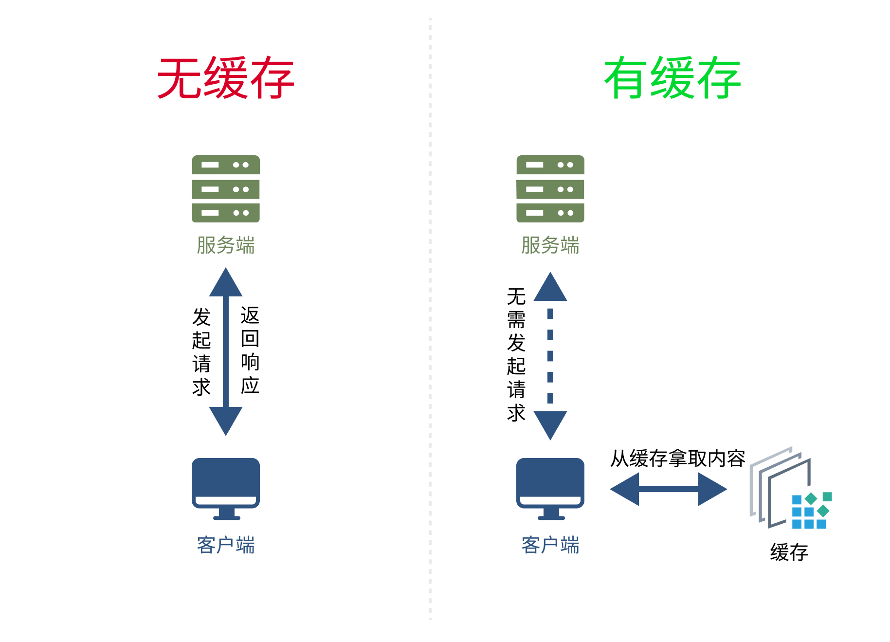
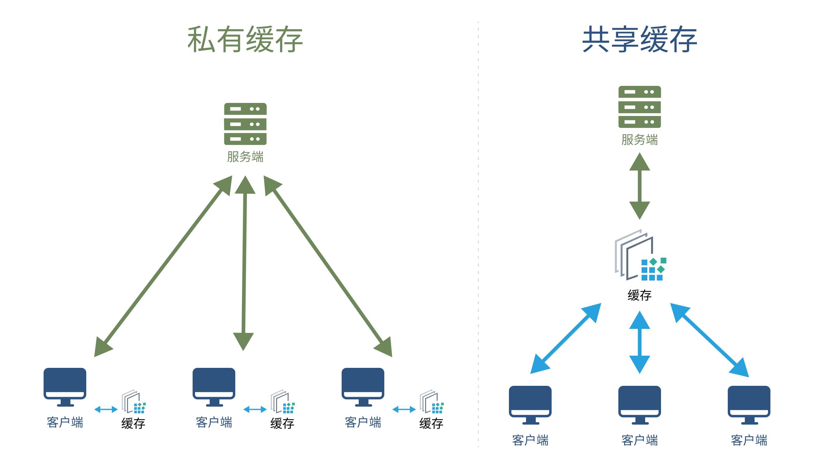
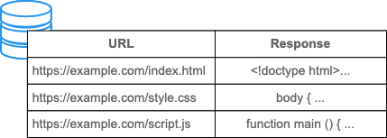
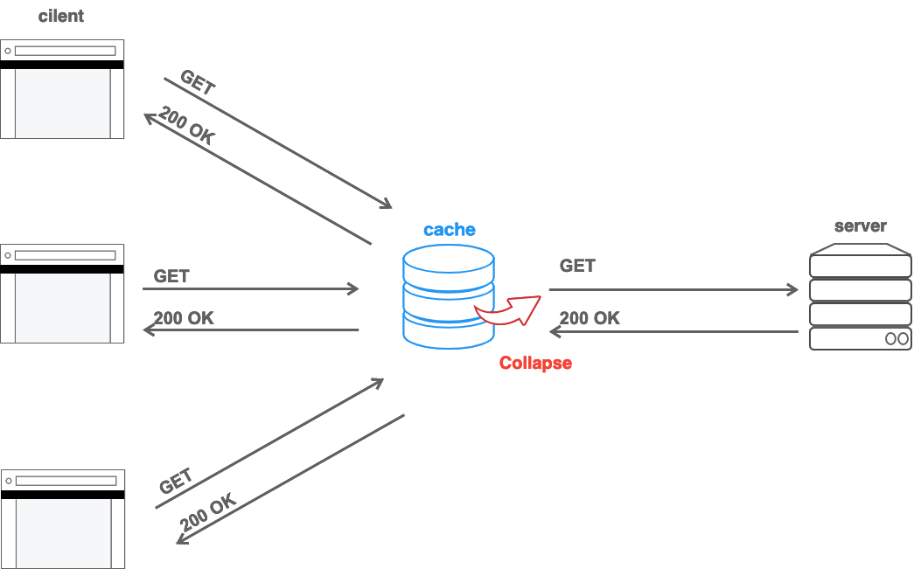

# HTTP缓存

**HTTP缓存是一种HTTP的性能优化机制，它是为了提高Web页面加载速度和减轻服务器负载而设计的，通过这种机制，Web浏览器或其他客户端可以存储先前获取的Web资源的副本，并在后续请求相同资源时使用这些副本，而不是再次从服务器请求。** 通过使用HTTP缓存，可以减少对服务器的请求次数，这有助于减少请求的网络延迟、提高网页加载速度、降低服务器负载，以及减少网络流量。



## 缓存的分类

在 [HTTP Caching](https://httpwg.org/specs/rfc9111.html) 标准中，有两种不同类型的缓存：**私有缓存**和**共享缓存**：

- **私有缓存**：绑定到特定客户端的缓存——通常是浏览器缓存，由于存储的响应不与其他客户端共享，因此私有缓存可以存储该用户的个性化响应。

- **公有缓存**：位于客户端和服务器之间的缓存——通常是代理服务器缓存、CDN以及反向代理等，存储的缓存能被所有用户共享。

  ::: danger 注意

  近年来，随着 HTTPS 变得越来越普遍，客户端/服务器通信变得加密，在许多情况下，路径中的代理缓存只能传输响应而不能充当缓存。

  :::

  

  



::: danger 请勿缓存带有 Authorization 标头或使用了Cookie做身份认证的响应

使用了Cookie做身份认证或Authorization 标头通常包含用于进行身份验证的敏感信息，例如用户的用户名和密码，或者访问令牌（access token）。如果将这些包含敏感信息的响应存储在缓存中将会存在安全风险

::: 


## 缓存的工作流程

HTTP缓存运行主要依赖服务端设置`Cache-Control`、`Etag`、`Age`、`Expires`以及`Vary`等响应标头来指定相应的缓存策略，客户端通过自动携带`If-Modified-Since` 、 `If-None-Match` 等请求标头来验证缓存的有效性。**由于客户端的相关请求标头都是自动携带的，因此缓存的配置通常只发生在服务端**，具体工作流程如下：


- **客户端首次请求**：当浏览器需要获取一个Web资源（例如HTML文档、图像、CSS文件等）时，它向服务器发送一个HTTP请求。

- **服务端携带缓存策略返回响应**：服务器收到请求后，会返回所请求资源的响应，该响应中包含了与缓存相关的信息，如：使用`Cache-Control`指定的缓存策略，使用`age`，`Expires`，max-age控制缓存时间，`ETag`控制缓存版本，`vary`控制缓存的位置等

- **客户端再次请求相同资源**：客户端再次请求相关资源，浏览器会首先检查本地缓存，看是否已经有了所请求资源的副本。如果有缓存且

  - **缓存有效（根据服务端设置的缓存策略来判断）**：浏览器可以直接从缓存中获取资源，无需再次向服务器发起请求。

  - **缓存无效**：但缓存策略中具有`ETag`或`Last-Modified`等验证信息，浏览器可以通过条件请求（携带`If-Modified-Since` 、 `If-None-Match` 等请求标头）向服务器发起验证请求。服务器根据验证信息判断资源是否已经发生变化，如果没有变化，服务器将会返回一个304 Not Modified响应，告诉浏览器资源没有发送变化，可以使用缓存中的副本，此时客户端则会直接从缓存中获取资源。如果缓存无效或没有缓存，或者服务器返回了新的资源，浏览器会获取服务器的最新副本，并将其存储在缓存中。


### 私有缓存与共享缓存

上文介绍了缓存分为了**私有缓存**与**共享缓存**，私有缓存是绑定到特定客户端的缓存——通常是浏览器缓存，由于存储的响应不与其他客户端共享，因此私有缓存可以存储该用户的个性化响应；而共享缓存则是位于客户端和服务器之间的缓存——通常是代理服务器缓存、CDN以及反向代理等，存储的缓存能被所有用户共享。

如何设置缓存为**私有缓存**还是**共享缓存**呢？答案是设置`Cache-Control`，**当把`Cache-Control`设置为private则为私有缓存，此时响应仅会存储在特定的客户端缓存中；当把`Cache-Control`设置为public并携带了s-maxage参数（例如：s-maxage=3600）则为共享缓存，此时响应仅会存储在客户端和服务器之间的缓存中**。

```http
Cache-Control: private   //设置缓存为私有缓存
Cache-Control: public, s-maxage=3600    //设置缓存为共享缓存
```

值得注意的是，**如果仅是把`Cache-Control`设置为public但不携带s-maxage参数，则表示响应可以被任何对象缓存，即使是通常不可缓存的内容，比如携带了`Authorization` 标头的响应通常是不能被存储的，但指定了public则可被存储。这也意味着无论是私有缓存或是共享缓存都会存储任何响应。**

```http
Cache-Control:public //意味着缓存是公开的，且可以由任何缓存存储和共享，无论是私有缓存还是公共缓存。
```

`Cache-Control`的默认行为也是比较特殊的，对于没有明确设置 `Cache-Control` 的响应，其行为与将`Cache-Control` 设置为public相似，它可以被私有缓存或是共享缓存存储，但它又与public不同，一些存在特殊标头的响应不会被存储，例如携带了`Authorization` 标头的响应不会被存储。


### 控制缓存时间

HTTP缓存提供了两种方式来控制缓存的有效时间：`Expires`、`max-age`。


#### Expires

**`Expires` 响应标头使用绝对时间来指定缓存的生命周期**，如下所示：

```HTTP
Expires: Tue, 28 Feb 2022 22:22:22 GMT  
//指定缓存2022年2月28日星期二22:22:22 过期
```

使用`Expires` 响应标头控制缓存时间存在很多问题——时间格式难以解析，并且**判断缓存是否过期是根据客户端时间来计算的，这也就意味着用户可以通过更改客户端时间来使得缓存延期！** 如下所示：

```http
Expires: Tue, 28 Feb 2022 22:22:22 GMT  
//指定缓存2022年2月28日星期二22:22:22 过期
// 用户将客户端时间从2022年2月29日更改为了2022年2月27日
// 原本过期的缓存变为了有效
```


#### max-age

针对该问题，在 HTTP/1.1 中，`Cache-Control` 采用了 `max-age`来控制缓存的有效时间。**`max-age`通过指定缓存经过多少秒后（相对于请求的时间）过期来规定其生命周期**，如下所示：

```http
Cache-Control: max-age=604800  //指定缓存经过604800秒(一周)后过期
```

**当响应存储在共享缓存中时，还有必要返回`Age`响应标头，说明该缓存已在共享缓存中缓存了多长时间，此时客户端的缓存有效时间则为`max-age`减去`Age`**。

```HTTP
// 共享缓存返回如下响应
Cache-Control: max-age=604800  //指定缓存经过604800秒(一周)后过期
Age: 86400    //该缓存已在共享缓存中存储了86400秒(一天)
// 客户端缓存的有效时间则为：604800-86400=518400（六天）
```

**`s-maxage`与`max-age`的功能完全一致，只不过指定了`s-maxage`的响应仅会存放在共享缓存中，并不会存放在私有缓存中，且会覆盖`max-age`或者`Expires`头。**

::: danger  `Expires` 和 `Cache-Control: max-age` 同时存在， `Cache-Control: max-age` 优先

 `Cache-Control: max-age` 的出现本就是为解决 `Expires` 的问题出现的，因此当响应同时存在 `Expires` 和 `Cache-Control: max-age` 可用，缓存的有效期将会按照`Cache-Control: max-age` 指定的执行。

:::


### 控制缓存存放位置

缓存的存放位置本质上是基于URL的，对于不同URL的响应内容，缓存将会单独存放：



但即使是相同的URL，有时响应的内容并不总是相同，特别是使用 `Accept`、`Accept-Language` 和 `Accept-Encoding` 等请求标头进行内容协商时。

例如，对于带有 `Accept-Language: en` 标头并已缓存的英语内容，不希望再对具有 `Accept-Language: ja` 请求标头的请求重用该缓存响应。在这种情况下，你可以通过在 `Vary` 标头的值中添加“`Accept-Language`”，根据语言单独缓存响应。

```HTTP
Vary: Accept-Language
```

这会导致缓存基于响应 URL 和 `Accept-Language`请求标头的组合进行键控——而不是仅仅基于响应 URL。


### 验证过期缓存

HTTP 缓存有一种机制，**对于指定了资源更改时间（Last-Modified）或版本号（ETag ）的过期的缓存并不会立即被丢弃，在客户端再次请求该内容时会先发起请求询问服务端缓存内容是否已更新，如果内容已更新则返回新的内容，如果未更新则直接拿取缓存中过期的内容使用即可**。这种通过询问源服务器将陈旧的响应转换为新的响应被称为**验证**，有时也被称为**重新验证**，这种机制的存在避免了重新传输相同的资源，提高性能并减少带宽消耗。

验证有两种方式，一种是**基于时间（Last-Modified/If-Modified-Since）的验证**，另一种则是**基于版本（ETag/If-None-Match）的验证**。


#### 基于时间的验证——Last-Modified/If-Modified-Since

当客户端首次请求资源时，**服务器的响应会携带`Last-Modified`响应标头来表明请求资源最后被修改的时间，通常情况下，服务器会根据文件系统中资源的最后修改时间自动设置这个标头。** 如下所示：

```http
HTTP/1.1 200 OK
Last-Modified: Tue, 22 Feb 2022 22:00:00 GMT
Cache-Control: max-age=3600
........
```

客户端收到响应后会将这个时间存储起来，并把响应存入缓存中。**当存储的响应过期失效，此时过期的缓存并不会立即被丢弃，当客户端再次请求资源时，它会自动在请求头中包含一个`If-Modified-Since`请求标头，该标头的值则为资源最后被修改的时间（上述响应中`Last-Modified`的值）**，如下所示：

```http
GET /index.html HTTP/1.1
If-Modified-Since: Tue, 22 Feb 2022 22:00:00 GMT
......
```

**服务器收到该请求后会比较这个时间戳与当前资源的最后修改时间。如果内容自指定时间以来没有更改，服务器将响应 `304 Not Modified`，告诉客户端可以直接使用过期的缓存，客户端收到此响应后会直接拿取过期缓存内容使用，并根据响应的缓存配置重新刷新过期缓存的状态。如果请求资源发生了更改，服务器将返回新的资源。**

基于时间的验证虽然避免了重新传输相同的资源的问题，但它也存在诸多问题：

- **时钟同步问题：** 基于时间的验证的前提条件是服务器和客户端的时钟是同步的。如果两者的时钟存在差异，可能会导致验证失败。这种情况下，服务器认为资源已经过期，但实际上客户端的时钟比服务器快或慢，导致了不必要的资源传输。
- **时间精度问题：** 时间戳通常只有秒级别的精度，这可能导致在某些情况下无法检测到资源的真正修改。如果两次修改之间的时间间隔很短，可能无法捕捉到变化。
- **服务器时钟回退：** 如果服务器的时钟回退（例如，由于时钟同步服务的干预），可能会导致客户端认为资源已经过期，尽管实际上它仍然是最新的。
- **不适合不稳定的资源：** 对于频繁更新的资源，基于时间的验证可能会导致较高的带宽消耗，因为客户端可能会在资源实际发生变化之前多次发起验证请求。
- **资源未被修改但最后修改时间已变：** 有时资源的内容并没有实际修改，但由于某些原因，最后修改时间被更新了。这可能导致不必要的资源传输。

为了解决这些问题，HTTP缓存推出了基于版本的验证作为替代方案。


#### 基于版本的验证——ETag/If-None-Match

当客户端首次请求资源时，**服务器的响应会携带`ETag`响应标头来表明请求资源的版本**，该标头的值是服务器生成的任意值，因此服务器可以根据他们选择的任何方式自由设置值——例如主体内容的哈希或版本号，如下所示：

```http
HTTP/1.1 200 OK
ETag: "deadbeef"
Cache-Control: max-age=3600
........
```

客户端收到响应后会`ETag`的值存储起来，并把响应存入缓存中。**当存储的响应过期失效，此时过期的缓存并不会立即被丢弃，当客户端再次请求资源时，它会自动在请求头中包含一个`If-None-Match`请求标头，该标头的值则为资源的版本号（上述响应中`ETag`的值）**，如下所示：

```http
GET /index.html HTTP/1.1
If-None-Match: "deadbeef"
......
```

**服务器收到该请求后会比较请求中的 `If-None-Match` 值与当前资源版本号是否相同，如果当前资源版本号与请求中的 `If-None-Match` 值相同，则服务器将返回 `304 Not Modified`，告诉客户端可以直接使用过期的缓存，客户端收到此响应后会直接拿取过期缓存内容使用，并根据响应的缓存配置重新刷新过期缓存的状态。如果当前资源版本号与请求中的 `If-None-Match` 值不同，则服务器将会使用 `200 OK` 和资源的最新版本进行响应。**

::: danger 注意

必须携带`ETag` 或 `Last-Modified` 响应标头的过期缓存才能重新验证，在评估如何使用 `ETag` 和 `Last-Modified` 时，请考虑以下几点：在缓存重新验证期间，如果同时存在`ETag`和`Last-Modified`，通常是`ETag`优先，只有在服务器不支持`ETag`或匹配失败的情况下，浏览器才会使用`Last-Modified`进行比较。因此，如果你只考虑缓存，你可能会认为 `Last-Modified` 是不必要的。然而，`Last-Modified` 不仅仅对缓存有用；相反，它是一个标准的 HTTP 标头，内容管理 (CMS) 系统也使用它来显示上次修改时间，由爬虫调整爬取频率，以及用于其他各种目的。所以考虑到整个 HTTP 生态系统，最好同时提供 `ETag` 和 `Last-Modified`。

:::


### 强制重新验证

如果你希望**即使是未过期的缓存也要[重新验证](#验证过期缓存)，想要始终从服务器获取最新的内容，那么你可以在响应标头中添加`Cache-Control: no-cache`或`Cache-Control: max-age=0, must-revalidate`**。`max-age=0` 意味着响应立即过时，而 `must-revalidate` 意味着缓存一旦过时就不能在没有重新验证的情况下重用它，因此两者结合起来，语义与 `no-cache` 相同。

**强制重新验证的流程与[验证过期缓存](#验证过期缓存)一致，只不过一个针对未过期的缓存，一个是针对已过期的缓存。当然与[验证过期缓存](#验证过期缓存)一样响应必须携带`Last-Modified`（资源更改时间）或`ETag`（ 版本号）才能走验证流程。**

> 强制重新验证示例

```http
Last-Modified: Tue, 22 Feb 2022 22:00:00 GMT
ETag: deadbeef
Cache-Control: no-cache
// 或
Last-Modified: Tue, 22 Feb 2022 22:00:00 GMT
ETag: deadbeef
Cache-Control: max-age=0, must-revalidate
```

::: danger  注意

`Cache-Control: no-cache` 指令不会阻止响应的存储，而是阻止在没有重新验证的情况下重用响应。

:::


### 不使用缓存

**如果你不想使用缓存，不希望将响应存储在任何缓存中，可以通过在响应标头中添加`Cache-Control: no-store`来实现。需要注意的是指定该指令只会阻止存储响应，但不会删除相同 URL 的任何已存储响应，也就是说如果已经为特定 URL 存储了旧响应，则返回 `no-store` 不会阻止旧响应被重用。**

> 不使用缓存示例

```http
Cache-Control: no-store
```

::: danger 请勿随意不使用缓存

你可能认为添加 `no-store` 是选择退出缓存的正确方法。但是，不建议随意授予 `no-store`，因为你失去了 HTTP 和浏览器所拥有的许多优势，包括浏览器的后退/前进缓存。因此，要获得 Web 平台的全部功能集的优势，最好将 `no-cache` 与 `private` 结合使用。

:::


### 无法删除以及重新验证的缓存

**对于指定了很长过期时间(`max-age`)且没有指定强制重新验证的缓存，基本上没有什么办法删除以及重新验证该缓存**！比如下述例子：

```http
HTTP/1.1 200 OK
Cache-Control: max-age=31536000 //指定缓存有效期为1年
```

该例子将缓存有效期指定为了1年，在这1年的时间里，由于缓存的存在并且没有指定强制重新验证，因此对于该资源的请求将不会到达服务器。除非用户手动执行重新加载、强制重新加载或清除历史操作，不然则无法删除以及重新验证该缓存。

这个例子告诉我们，**虽然缓存减少了对服务器的访问，但这也意味着服务器失去了对该 URL 的控制**。如果服务器不想失去对 URL 的控制，你应该添加 `no-cache`，以便服务器始终接收请求并发送预期的响应。


### 请求折叠

共享缓存主要位于源服务器之前，旨在减少到源服务器的流量。但共享缓存存在一个问题——**多个相同的请求同时到达共享缓存时，共享缓存只会把其中一个请求转发到源服务器，并且共享缓存收到源服务器响应后会将响应重用于所有请求**，这称为**请求折叠**。



当请求同时到达共享缓存会发生请求折叠，即使响应中给出了 `max-age=0` 或 `no-cache`，它也会被重用。因此如果响应是针对特定用户个性化的，并且你不希望它在折叠中共享，应该使用私有缓存，在响应中添加 `private` 指令。


## 可被缓存的请求方法

**HTTP协议定义了一些请求方法，其中一些方法通常可以被缓存。** 可被缓存的请求方法是那些在满足特定条件下，可以被缓存代理服务器（如HTTP缓存）缓存的方法。以下是常见的能否被缓存的HTTP请求方法：

- **`GET`、`HEAD`和`OPTIONS`方法： `GET`、`HEAD`和`OPTIONS`方法通常被认为是可缓存的**，因为它们是幂等且安全的，而且不会改变服务器状态。这意味着代理服务器可以缓存它们的响应，以提高性能并减轻服务器负载。
- **`POST`和`PATCH`方法：`POST`和`PATCH`方法的响应通常不会被缓存** ，因为它们通常用于向服务器提交数据，可能会改变服务器状态。然而，如果响应中指定了有效期（例如，通过`Cache-Control`头部）并设置了`Content-Location`头部，那么它们的响应可以被缓存。这种情况下，缓存代理服务器可以将响应缓存，并在之后的请求中使用。但这种情况下的缓存行为在实际应用中相对较少见，并且有些浏览器并不支持(例如Firefox 就不支持它[Firefox bug 109553](https://bugzil.la/109553))，因此通常不鼓励缓存`POST`请求的响应。
- **`PUT`和`DELETE`方法： `PUT` 和 `DELETE` 方法的响应通常不会被缓存**，即使设置了有效期（通过`Cache-Control`头部）和`Content-Location`标头。这是因为这两个请求方法通常用于对资源进行修改或删除，可能会改变服务器的状态，因此响应不适合被缓存。
- **`CONNECT` 方法：`CONNECT` 方法的响应通常不会被缓存** ，即使设置了有效期（通过`Cache-Control`头部）和`Content-Location`标头。`CONNECT` 方法用于建立网络连接，通常用于代理服务器。由于 `CONNECT` 方法的目的是在客户端和目标服务器之间建立连接，而不是获取资源，所以 `CONNECT` 方法的响应通常不会被缓存。代理服务器通常不会缓存 `CONNECT` 方法的响应，因为它们不包含可被缓存的资源数据。
- **`TRACE` 方法：`TRACE` 方法的响应通常不会被缓存** ，即使设置了有效期（通过`Cache-Control`头部）和`Content-Location`标头。`TRACE` 方法用于在目标服务器上执行一个诊断测试，它返回由服务器收到的请求的副本。由于 `TRACE` 方法的主要目的是用于诊断和调试，而不是对服务器上的资源进行修改，因此 `TRACE` 方法的响应通常不会被缓存。代理服务器通常不会缓存 `TRACE `方法的响应，因为这些响应只包含请求的副本，不包含可被缓存的资源数据。

| 能否缓存                   | 请求方法                    |
| :------------------------- | :-------------------------- |
| 可被缓存                   | GET、HEAD、OPTIONS          |
| 可被缓存，但不鼓励且支持少 | POST、PATCH                 |
| 不可被缓存                 | PUT、DELETE、CONNECT、TRACE |


## 相关标头


### Cache-Control `通用标头`

**通用标头`Cache-Control` 通常是由服务器在响应头中设置，配置缓存策略以指导客户端和中间缓存服务器如何处理响应的缓存。然而，在某些情况下，客户端也可以在请求头中使用 `Cache-Control` 标头，以向服务器传达有关请求的缓存期望。**

**参数**

- **\<cache-model>** `可选`

  指定缓存的模式，可选的属性值有：

  - `public`：表明响应可以被任何对象（无论是私有缓存还是共享缓存）存储，即使是通常不可缓存的内容，比如携带了`Authorization` 标头的响应通常是不能被存储的，但指定了public则可被存储。**注意该指令并不是指定缓存为[共享缓存](#私有缓存与共享缓存)**！
  - `private`：指定缓存为[私有缓存](#私有缓存与共享缓存)，表明响应只能被客户端缓存存储
  - `no-cache`：指定缓存[强制重新验证](#强制重新验证)，也就是说即使是未过期的缓存也要[重新验证](#验证过期缓存)，始终从服务器获取最新的内容。注意**该指令不会阻止响应的存储，而是阻止在没有重新验证的情况下重用响应**。
  - `no-store`：指定[不使用缓存](#不使用缓存)，也就是说不存储有关客户端请求或服务器响应的任何内容，即不使用任何缓存。注意**该指令只会阻止存储响应，但不会删除相同 URL 的任何已存储响应，也就是说如果已经为特定 URL 存储了旧响应，则返回 `no-store` 不会阻止旧响应被重用**。

- **max-age=\<seconds>** `可选`

  指定缓存经过多少秒后（相对于请求的时间）过期

- **s-maxage=\<seconds>** `可选`

  指定缓存经过多少秒后（相对于请求的时间）过期，`s-maxage`与`max-age`的功能完全一致，只不过`s-maxage`仅适用于共享缓存 ，私有缓存会忽略它。

- **max-stale=\<seconds>** `可选`

  表明客户端愿意接收一个已经过期的资源。可以设置一个可选的秒数，表示响应不能已经过时超过该给定的时间。

- **min-fresh=\<seconds>** `可选`

  表示客户端希望获取一个能在指定的秒数内保持其最新状态的响应。

- **stale-while-revalidate=\<seconds>** `可选` `实验性`

  表明客户端愿意接受陈旧的响应，同时在后台异步检查新的响应。秒值指示客户愿意接受陈旧响应的时间长度。

- **stale-if-error=\<seconds>** `可选` `实验性`

  表示如果新的检查失败，则客户愿意接受陈旧的响应。秒数值表示客户在初始到期后愿意接受陈旧响应的时间。

- **must-revalidate** `可选`

  一旦缓存过期（比如已经超过`max-age`），在成功向原始服务器验证之前，不是使用该缓存。

- **proxy-revalidate** `可选`

  与 must-revalidate 作用相同，但它仅适用于共享缓存（例如代理），并被私有缓存忽略。

- **immutable** `可选`

  表示响应的内容永远不会发生更改，请谨慎使用该头，因为这可能会导致[无法删除以及重新验证缓存](#无法删除以及重新验证的缓存)。

- **no-transform** `可选`

  不得对资源进行转换或转变。`Content-Encoding`、`Content-Range`、`Content-Type`等 HTTP 头不能由代理修改。例如，非透明代理或者如[Google's Light Mode](https://support.google.com/webmasters/answer/6211428?hl=en)可能对图像格式进行转换，以便节省缓存空间或者减少缓慢链路上的流量。`no-transform`指令不允许这样做。

- **only-if-cached** `可选`

  表明客户端只接受已缓存的响应，并且不要向原始服务器检查是否有更新的拷贝。

**示例**

```http
Cache-Control: no-store  //不使用缓存
Cache-Control:public, s-maxage=31536000 // 仅允许共享缓存存储响应
Cache-Control: no-cache //指定强制重新验证
```


### Expires `响应标头`

**响应标头`Expires ` 通过使用绝对时间来指定缓存的的过期时间**

**参数**

该响应标头并无其他参数

**取值**

- **\<date>**

  指定一个绝对时间表明缓存的过期时间

**示例**

```http
Expires: Wed, 21 Oct 2015 07:28:00 GMT
```

::: danger 注意

使用`Expires` 响应标头控制缓存时间存在很多问题——时间格式难以解析，并且**判断缓存是否过期是根据客户端时间来计算的，这也就意味着用户可以通过更改客户端时间来使得缓存延期！** 为解决这些问题，我们应该使用`Cache-Control: max-age`来指定缓存的生命周期

:::


### Vary `响应标头`

**响应标头`Vary`通过指定一系列的请求标头，使得缓存的存放位置不再仅基于响应URL，而是与指定的请求标头进行组合键控。**

**参数**

该响应标头并无其他参数

**取值**

- **\***

  指定与任何请求头字段进行组合键控。

- **<heder-name,heder-name, heder-name,.......>**

  请求标头列表，用逗号（`', '`）隔开，指定与相关请求标头进行组合键控。

**示例**

```http
Vary: Accept-Language
Vary: Accept-Language,User-Agent
```


### Last-Modified `响应标头`

**响应标头`Last-Modified`指定了响应的资源最后被修改的时间，通常情况下，服务器会根据文件系统中资源的最后修改时间自动设置这个标头。**

**参数**

该响应标头并无其他参数。

**取值**

- **\<date>**

  一个绝对时间，指定响应的资源最后被修改的时间。

**示例**

```http
Last-Modified: Wed, 21 Oct 2015 07:28:00 GMT
```


### If-Modified-Since `请求标头`

**请求标头`If-Modified-Since`指定了一个绝对时间，表示在缓存中过期的响应内容的最后修改时间，携带该标头希望服务器检查该响应是否在指定的修改时间之后发生过更改，能否继续使用该过期的内容。** 该头通常是由浏览器在发起 GET 请求时自动携带的，其值为缓存的过期响应中 `Last-Modified` 的值。

::: danger 注意

当与 `If-None-Match` 一同出现时，它（**`If-Modified-Since`**）会被忽略掉，除非服务器不支持 `If-None-Match`。

:::

**参数**

该请求标头并无其他参数。

**取值**

- **\<date>**

  一个绝对时间，表示在缓存中过期的响应内容的最后修改时间。

**示例**

```http
If-Modified-Since: Wed, 21 Oct 2015 07:28:00 GMT
```


### ETag `响应标头`

**响应标头`ETag`指定了一个版本号，表明响应的资源的版本**，该标头的值是服务器生成的任意值，因此服务器可以根据他们选择的任何方式自由设置值——例如主体内容的哈希或版本号。

**参数**

- **W/** `可选`

  `'W/'`(大小写敏感) 表示使用[弱验证器](https://developer.mozilla.org/zh-CN/docs/Web/HTTP/Conditional_requests#weak_validation)。弱验证器很容易生成，但不利于比较。强验证器是比较的理想选择，但很难有效地生成。相同资源的两个弱`Etag`值可能语义等同，但不是每个字节都相同。

- **\"<etag_value>"**

  指定一个版本号，没有明确指定生成 ETag 值的方法。通常，使用内容的散列，最后修改时间戳的哈希值，或简单地使用版本号。例如，MDN 使用 wiki 内容的十六进制数字的哈希值。

**示例**

```http
ETag: "33a64df551425fcc55e4d42a148795d9f25f89d4"
ETag: W/"0815"
```


### If-None-Match `请求标头`

**请求标头`If-None-Match`指定了一个版本号，携带该标头希望服务器检查资源是否与给定版本号匹配，如果匹配，则返回状态码 304 Not Modified，表示资源没有变化，客户端可以继续使用缓存过期的版本。** 该头通常是由浏览器在发起 GET 请求时自动携带的，其值为缓存的过期响应中 `ETag` 的值。

**参数**

该请求标头并无其他参数。

**取值**

- **W/** `可选`

  `'W/'`(大小写敏感) 表示使用[弱验证器](https://developer.mozilla.org/zh-CN/docs/Web/HTTP/Conditional_requests#weak_validation)。弱验证器很容易生成，但不利于比较。强验证器是比较的理想选择，但很难有效地生成。相同资源的两个弱`Etag`值可能语义等同，但不是每个字节都相同。

- **\"<etag_value>"**

  指定一个版本号，表示希望服务器检查资源是否与给定版本号匹配。

- **\*** `可选`

  星号是一个特殊值，可以代表任意资源。它只用在进行资源上传时，通常是采用 [`PUT`](https://developer.mozilla.org/zh-CN/docs/Web/HTTP/Methods/PUT) 方法，来检测拥有相同识别 ID 的资源是否已经上传过了。

**示例**

```http
If-None-Match: "bfc13a64729c4290ef5b2c2730249c88ca92d82d"
If-None-Match: W/"67ab43", "54ed21", "7892dd"
If-None-Match: *
```


## 常见的缓存模式

- **启发式缓存**：当响应没有给出 `Cache-Control`，但响应中包含了`Last-Modified`以及`Expires`标头，响应也会被存储和重用，缓存的时间取决于实现，但规范建议存储后大约 10%的时间，这称为**启发式缓存**。

  ::: danger 注意

  启发式缓存是在 `Cache-Control` 被广泛采用之前出现的一种解决方法，基本上所有响应都应明确指定 `Cache-Control` 标头。

  ::: 

- **零缓存**：顾名思义是一种禁止对资源进行缓存的策略，通过使用`Cache-Control: no-store`标头，指示客户端和所有中间缓存不存储有关客户端请求或服务器响应的任何内容，通常用于敏感数据或对即时性要求非常高的场景。

- **协商缓存**：协商缓存是一种通过与服务器协商确定是否需要重新获取资源的缓存策略，协商缓存分为两种：

  - 版本协商：使用`ETag`和`If-None-Match`等标头进行版本协商缓存。
  - 时间协商：使用`Last-Modified`和`If-Modified-Since`等标头进行时间协商缓存。

  当客户端发送请求时，服务器会根据这些标头的值判断是否需要返回新的内容。协商缓存通常用于资源可能发生变化但并不频繁的情况下，主要用于主资源的缓存。

- **缓存破坏**：缓存破坏是一种通过指定缓存永久有效，然后修改资源的URL来破坏缓存确保客户端获取最新版本的方法。在每次资源发生变化时，通过更改资源的URL来触发缓存破坏。例如，在资源的URL中添加时间戳、版本号或随机数，以确保每次更改都会导致新的URL，从而绕过缓存。破坏缓存适用于JS、CSS、图像、视频等静态不可变的资源。

::: tip 常用的缓存配置值

[PACK](https://datatracker.ietf.org/doc/html/rfc9204) 是一种用于压缩 HTTP 标头字段的标准，其中定义了常用字段值表，如果你使用下述缓存配置值，在 HTTP/3 传输时会将值压缩为 1 个字节。

```http
cache-control max-age=0
cache-control max-age=604800
cache-control max-age=2592000
cache-control no-cache
cache-control no-store
cache-control public, max-age=31536000
```

:::


## 本节参考

- https://developer.mozilla.org/zh-CN/docs/Web/HTTP/Headers/Expires
- https://web.dev/articles/http-cache?hl=zh-cn#overview
- https://http.dev/caching
- https://developer.mozilla.org/zh-CN/docs/Web/HTTP/Caching
- https://developer.mozilla.org/zh-CN/docs/Web/HTTP/Headers/Cache-Control
- https://developer.mozilla.org/zh-CN/docs/Web/HTTP/Headers/Vary
- https://developer.mozilla.org/zh-CN/docs/Web/HTTP/Headers/Last-Modified
- https://developer.mozilla.org/zh-CN/docs/Web/HTTP/Headers/If-Modified-Since

转载需要经过本人同意，并标明出处！